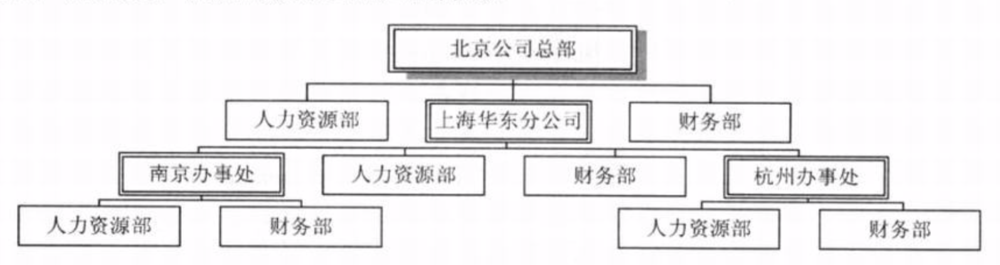
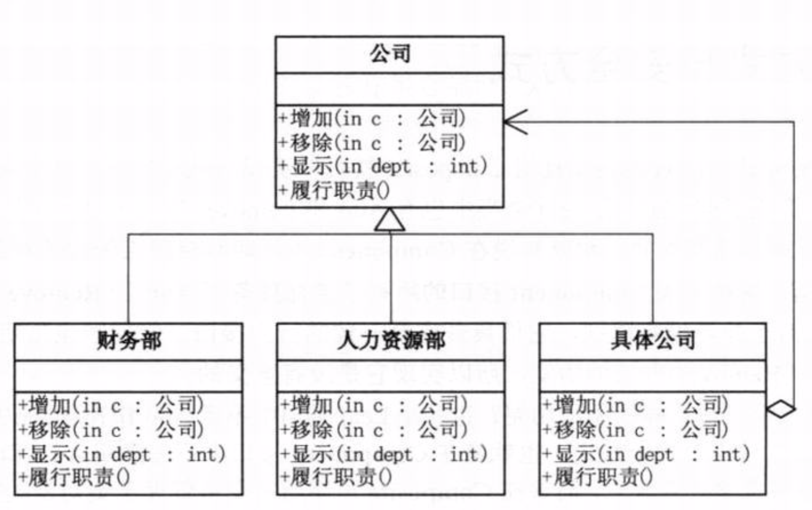
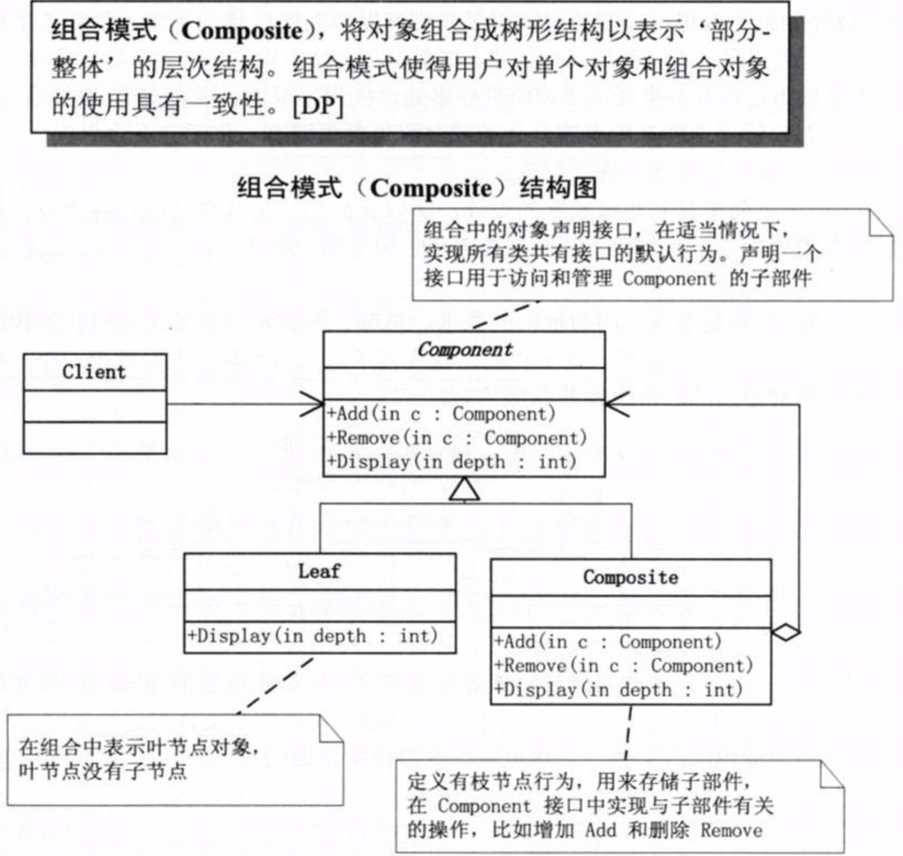
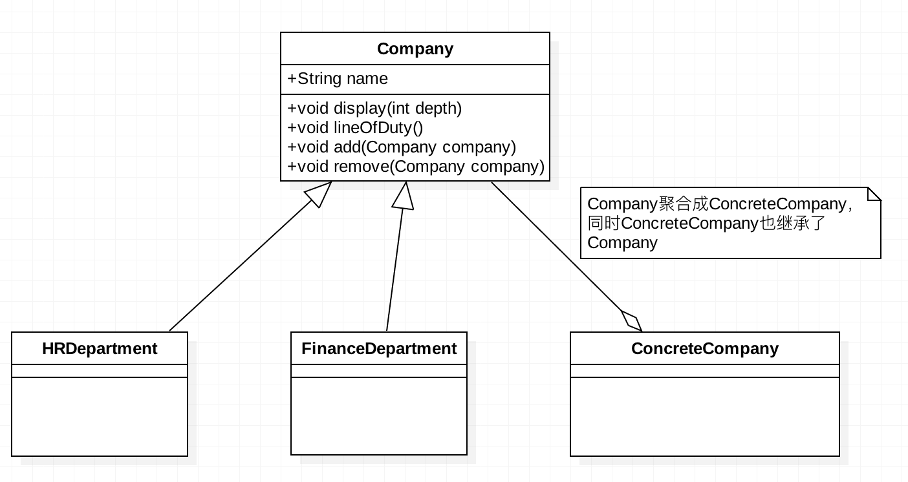
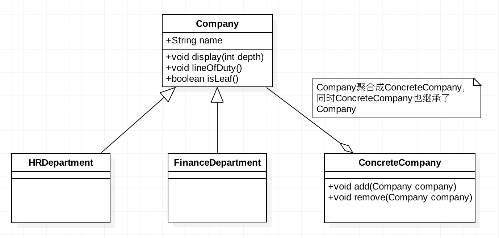

# 业务场景

某公司总部在北京，在全国各大城市设有分公司，比如上海设有华东分区，另外在一些省会城市还设有办事处，比如南京有南京办事处，杭州有杭州办事处。另外，各级公司均配备有自己的人力资源部、财务部，要求总公司的人力资源部、财务部的功能，各级子公司都有。

+ 首先，不可以简单的采用平行的方式复用代码。比如传递一个参数ID过去，然后执行每个方法之前先根据ID判断属于总公司还是分公司，因为总部、分部、办事处是有组织架构的，是一个树形结构。

+ 实际生活中，还有很多类似的例子，比如卖电脑的商家可以卖整机，也可以卖配件；复制文件可以复制单个文件，也可以复制整个文件夹；文本编辑可以给单个文本加粗、变色，也可以给整段文本加粗、变色。这实际上是一个**整体与部分可以被一致对待的问题**。

# 组合模式
+ **组合模式：将对象组合成树形结构以表示“部分-整体”的层次结构。组合模式使得用户对单个对象和组合对象的使用具有一致性。**

+ 组合模式有透明方式与安全方式。
  + 透明方式是将所有枝节点和叶节点，都实现一个统一接口，这样做的好处就是枝节点和叶节点对外界来说没有区别，它们具备完全一致的行为接口。但是问题也很明显，因为叶节点本身并不具备添加(add)、删除(remove)等功能，也就是说它们的实现是无意义的。
  
  + 安全方式，就是在Component中并不声明管理子节点的方法(add,remove)，而是在Composite中去声明，而Leaf继承Component，自然就不具备add,remove这些不必要的方法了，但缺点是所有的树叶和树枝将不具有相同的接口，所以客户端调用前需要做相应的判断，带来了不便。

# 使用场景
+ 需求中体现的是部分与整体的层次结构时，以及你希望用户可以忽略单个对象和组合对象的不同，统一地使用组合结构中的所有对象时，就可以考虑使用组合模式。

# 解决方案
本文开头部分提出的问题，采用组合模式，解决方案如下：

代码参考项目中demo1的代码。另外，自行扩展了一下安全方式的解决方案，见demo2。

# UML类图

+ 组合模式

+ 组合模式---透明方式

+ 组合模式---安全方式

	    
	    
	            
	    