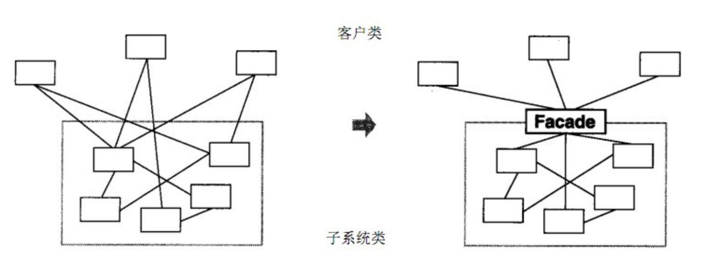
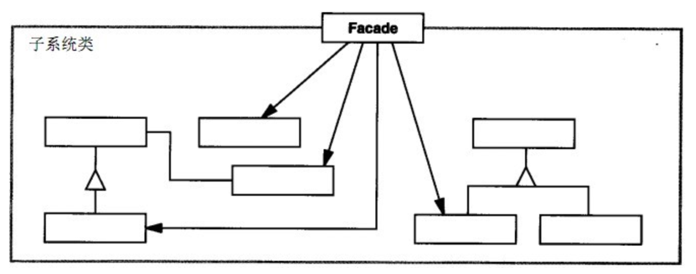
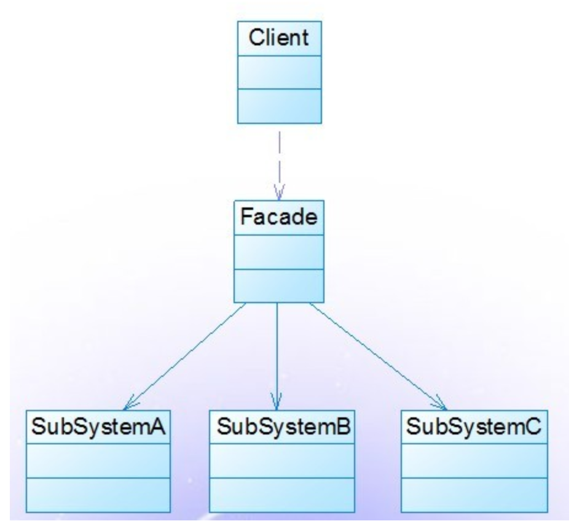
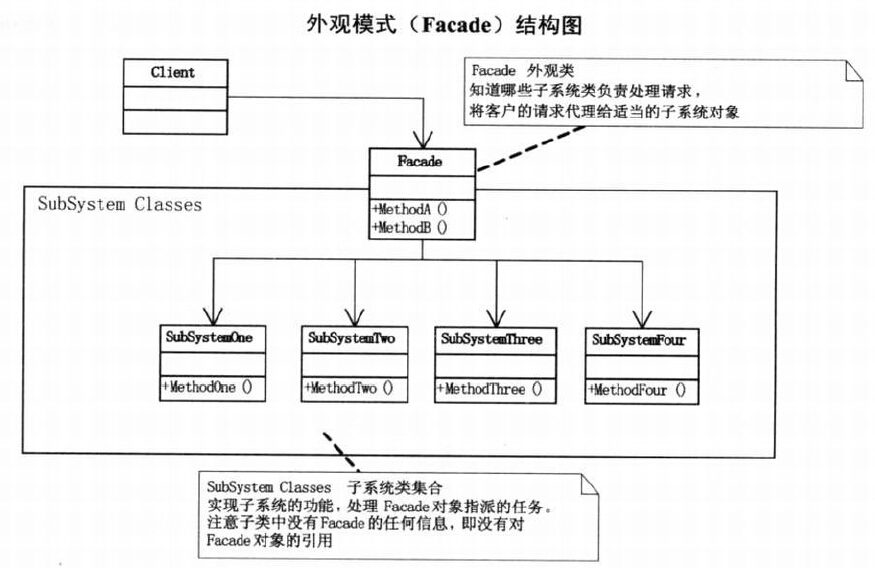

# 概述

外观模式，我们通过外观的包装，使应用程序只能看到外观对象，而不会看到具体的细节对象，这样无疑会降低应用程序的复杂度，
并且提高了程序的可维护性。 
例如：一个电源总开关可以控制四盏灯、一个风扇、一台空调和一台电视机的启动和关闭。
该电源总开关可以同时控制上述所有电器设备，电源总开关即为该系统的外观模式设计。

# 问题

为了降低复杂性，常常将系统划分为若干个子系统。但是如何做到各个系统之间的通信和相互依赖关系达到最小呢？

# 解决方案

外观模式：为子系统中的一组接口提供一个一致的界面，Facade模式定义了一个高层接口，这个接口使得这一子系统更加容易使用。
引入外观角色之后，用户只需要直接与外观角色交互，用户与子系统之间的复杂关系由外观角色来实现，从而降低了系统的耦合度。

# 适用性
在遇到以下情况使用facade模式：
1. 当你要为一个复杂子系统提供一个简单接口时。子系统往往因为不断演化而变得越来越复杂。大多数模式使用时都会产生更多更小的类。
   这使得子系统更具可重用性，也更容易对子系统进行定制，但这也给那些不需要定制子系统的用户带来一些使用上的困难。facade可以
   提供一个简单的缺省视图，这一视图对大多数用户来说已经足够，而那些需要更多的可定制性的用户可以越过facade层。
2. 客户程序与抽象类的实现部分之间存在着很大的依赖性。引入 facade将这个子系统与客户以及其他的子系统分离，可以提高子系统的独立性 和可移植性。
3. 当你需要构建一个层次结构的子系统时，使用 facade模式定义子系统中每层的入口点。如果子系统之间是相互依赖的，你可以让它们
   仅通过facade进行通讯，从而简化了它们之间的依赖关系。

# 结构

# 构建模式的组成

+ 外观角色（Facade）：是模式的核心，他被客户client角色调用，知道各个子系统的功能。同时根据客户角色已有的需求预订了
  几种功能组合。
+ 子系统角色（Subsystem classes）：实现子系统的功能，并处理由Facade对象指派的任务。对子系统而言，facade和client
  角色是未知的，没有Facade的任何相关信息；即没有指向Facade的实例。
+ 客户角色（client）：调用facade角色获得完成相应的功能。

# 效果
+ Facade模式有下面一些优点：
1. 对客户屏蔽子系统组件，减少了客户处理的对象数目并使得子系统使用起来更加容易。通过引入外观模式，客户代码将变得很简单，
   与之关联的对象也很少。
2. 实现了子系统与客户之间的松耦合关系，这使得子系统的组件变化不会影响到调用它的客户类，只需要调整外观类即可。
3. 降低了大型软件系统中的编译依赖性，并简化了系统在不同平台之间的移植过程，因为编译一个子系统一般不需要编译所有其他的
   子系统。一个子系统的修改对其他子系统没有任何影响，而且子系统内部变化也不会影响到外观对象。
4. 只是提供了一个访问子系统的统一入口，并不影响用户直接使用子系统类。

+ Facade模式的缺点:
1. 不能很好地限制客户使用子系统类，如果对客户访问子系统类做太多的限制则减少了可变性和灵活性。
2. 在不引入抽象外观类的情况下，增加新的子系统可能需要修改外观类或客户端的源代码，违背了“开闭原则”。

# 总结
+ 首先，在设计初期应该有意识的将不同两个层分离，比如经典的三层架构,数据库访问层(Dao),业务逻辑层(Service)，表示层。
  层与层之间建立外观Facade，这样可以为复杂的子系统提供一个简单的接口，使得耦合大大降低。
+ 其次，在开发阶段子系统往往因为不断的重构演化而变得越来越复杂，大多数模式在使用的时候都会产生很多很小的类，这本身是好事，
  但是也给外部调用它们的应用程序带来了使用上的困难，增加一个Facade可以提供一个简单的接口，减少它们之间的依赖。
+ 第三，在维护一个遗留的大型系统时，可能这个系统已经非常难以维护和扩展了，但因为它包含非常重要的功能，新的需求开发必须依赖它，
  此时外观模式也很适合。你可以为新系统开发一个Facade类，来提供设计粗糙或高度复杂的遗留代码的简单接口。让新系统与Facade
  对象交互,Facade对象与遗留代码交互所有复杂的工作.

# 个人感悟
外观模式的强调的重点不是封装继承多态等，而是一种开发的思想。各个子系统与Facade并没有继承的关系，它们之间的关系是关联的关系，
即Facade知道所有的子系统类，Facade可以根据客户端需求，随意组合调用子系统中的所有方法，从而实现相应的功能。比如说客户对基金
公司说我要赚钱，基金公司的相关人员，开始研究上千支股票，买A抛B，买C抛D等，各种组合最后达到客户要求赚钱的需求。

# UML类图

	    
	    
	            
	    