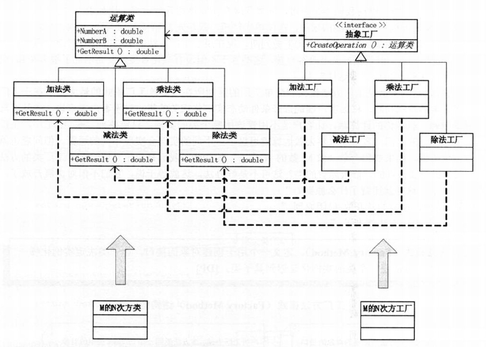
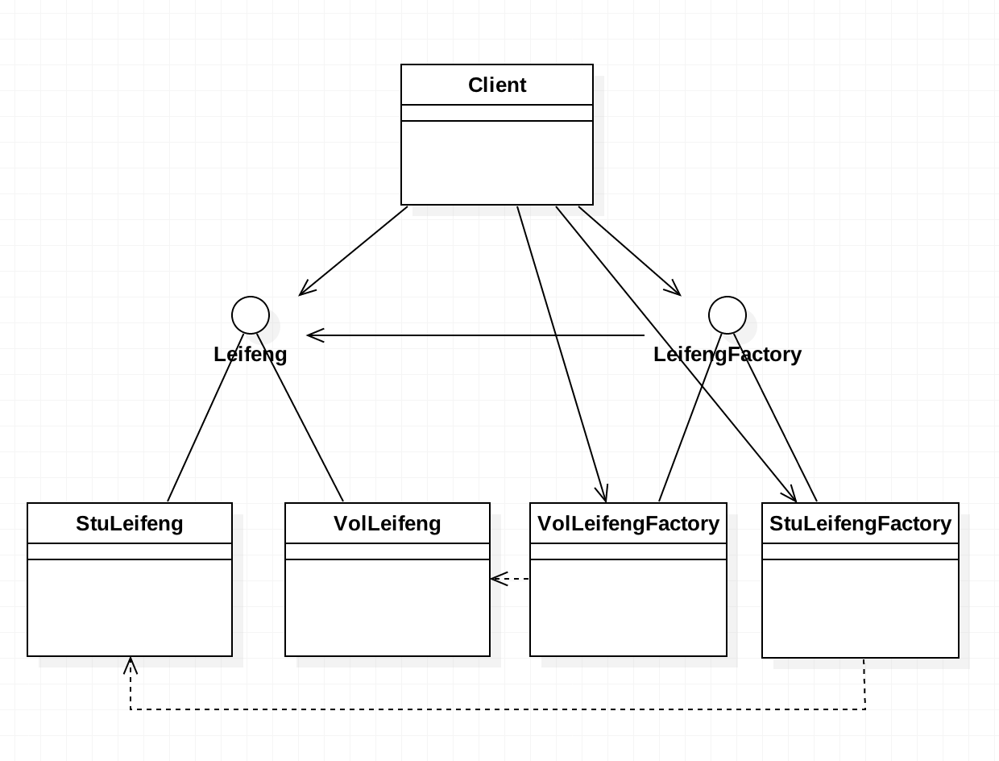
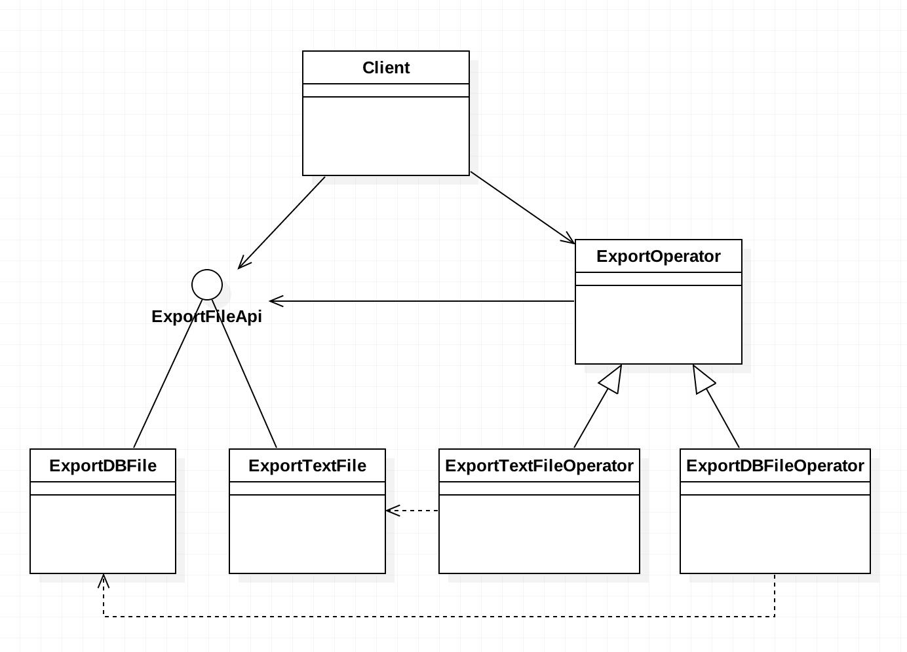

# 需求
+ 需求1：号召学雷锋行动，现在有三个学生学习雷锋做好事 。
+ 需求2：写一个导出文件的应用系统

# 分析		
+ 对于需求1，学雷锋的行为可以抽取一个接口。然后给它定义一些抽象方法，比如洗衣，拖地，做饭等。可以很简单的想到使用简单工厂模式。但是我们要考虑到接下来可能会有其他职业的人也要学雷锋，此时仍然可以用简单工厂。但是我们注意到一点，由于越来越多的人开始学雷锋，这种变化是经常性的，所以为了系统的稳定性（不能不断修改简单工厂的逻辑判断语句，新增分支语句），我们应该将工厂类也抽取一个接口出来，这个接口只定义创建产品的方法，而不负责具体产品的创建，而是交给它的子类去完成。
+ 对于需求2，导出文件的功能也可以抽取一个接口。给它定义一个export（）方法，但是由于我们不确定将来导出的是什么文件（可能是文本，图片，数据库文件等），所以文件导出工厂没法决定实例化哪个导出工具对象。这里同样推迟到工厂子类中实例化。

# 代码设计
 需求1的代码详见leifeng包。
+ 对比简单工厂模式，就是将实例化哪个类的判断逻辑抽取出来了，形成单独的工厂子类。这些具体的工厂类分别创建不同的产品。
+ 工厂方法模式：定义一个用于创建对象的接口，让工厂子类决定实例化哪个产品对象。工厂方法模式的核心就是将产品的实例化延迟到工厂子类。
+ 缺点:
   + 客户端需要不断改代码，当学生学雷锋时，需要创建学生雷锋工厂，当社区志愿者学雷锋时，需要创建志愿者雷锋工厂。
   + 当有新的群体加入学雷锋的行列时，如工人，需要同时新增工人类及工人雷锋工厂类2个类，对比简单工厂模式需要多增加一个工厂子类。
   + 由客户端决定实例化哪个类，选择判断的问题还是存在的，工厂方法只是把简单工厂内部的判断逻辑，移到了客户端来进行.
+ 优点:
   + 简单工厂当有新增的群体时，除了需要新增群体类外，还需要在工厂类中修改逻辑判断，增加分支语句。不符合开闭原则。而抽象工厂模式，只需要新增一个产品类，一个生成该产品的工厂类即可。完全符合"开放-封闭"原则.
   + 对于本例而言，在原需求的基础上，如果需要将学雷锋的对象改为社区志愿者，工厂方法模式只需要修改一行代码，就是把new StuLeifengFactory()改成 new VolLeifengFactory()即可。而简单工厂模式，则需要修改3行代码，即把每一行的参数"学生"改成"社区志愿者"。

需求2的代码详见export包。
+ 工厂方法模式的变种，客户端不再关注产品，只关注产品工厂。产品的功能转移到抽象工厂类里边了（底层还是调用产品的功能）。

# UML类图

