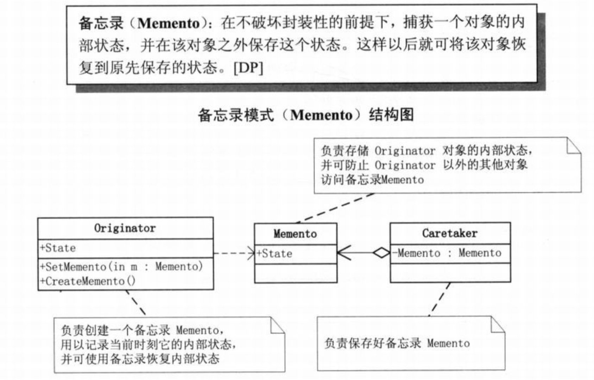
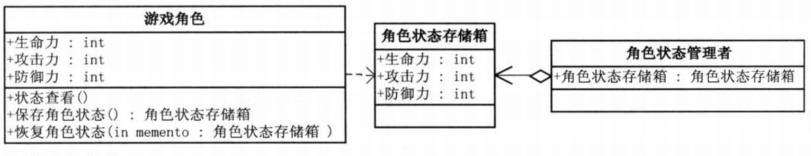
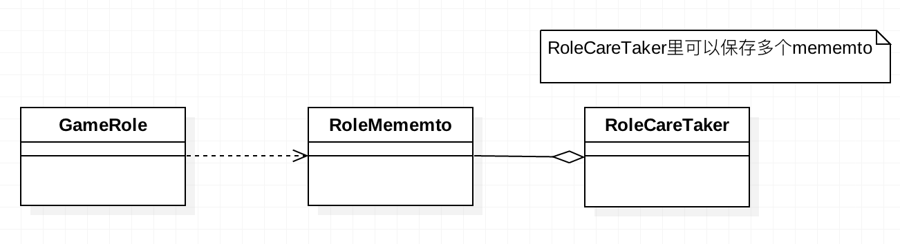

# 需求背景
玩游戏时，聪明的玩家总是在打Boss之前先将角色的各种生命值存档，然后再去打Boss，这样万一失败，还可以读档恢复到原来的状态。

# 需求分析
这里涉及到属性或字段的存储，常见的方法是直接创建或克隆一个新的实例，然后将原对象的所有属性值全部保存到新的示例上，原来的
对象经过某些处理后，如果需要恢复最初的属性值则从新实例上读取。这种方法最易想到，但是实际开发中，我们可能只需要保存部分属性，
并且我们还希望将这些状态保存在对象外部，那么就可以使用备忘录模式。

# 备忘录模式	
+ 在不破坏封装性的前提下，捕获一个对象的内部状态，并在该对象之外保存这个状态，这样以后可将该对象恢复到保存前的状态。
+ 什么时候用备忘录模式？Memento模式适用于功能比较复杂的，但需要维护和记录属性历史的类，或者需要保存的属性只是众多属性中
  的一小部分时，Originator可以根据保存的Memento信息还原到前一状态。
 
# 细节问题
+ 为什么要单独用一个Caretaker类来保存Memento？答：客户端不用创建Memento对象，不用知道还有Memento这个对象存在。也就是
  不用将Memento对象暴露出去。
+ 为什么不直接保存在Originator对象上？保存所有属性时可以考虑用clone方法，但保存部分属性时，没必要将所有属性都保存，用单独
  的Memento只保存部分属性。
  

# UML类图

