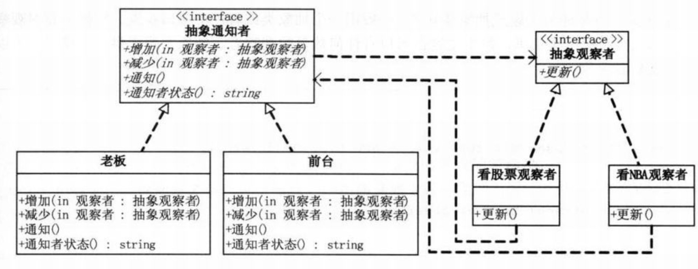
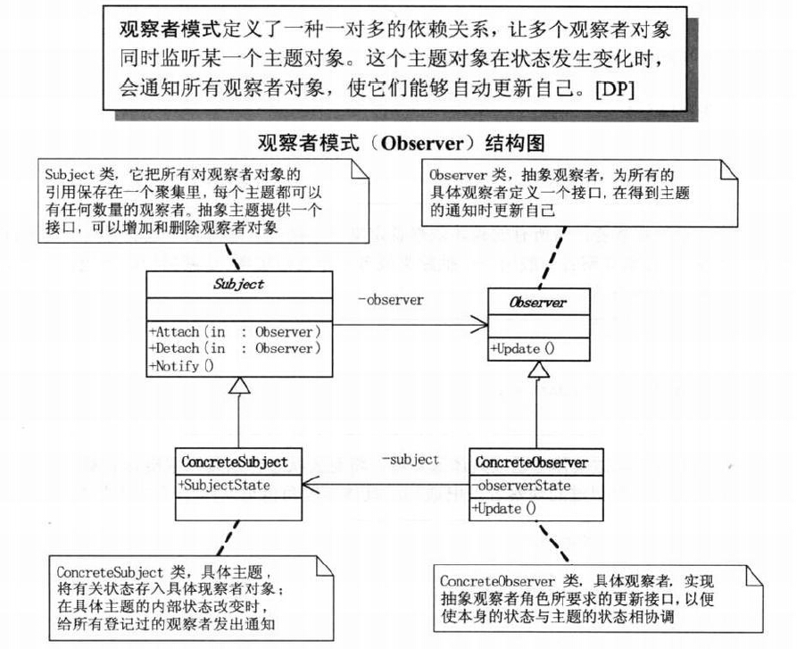
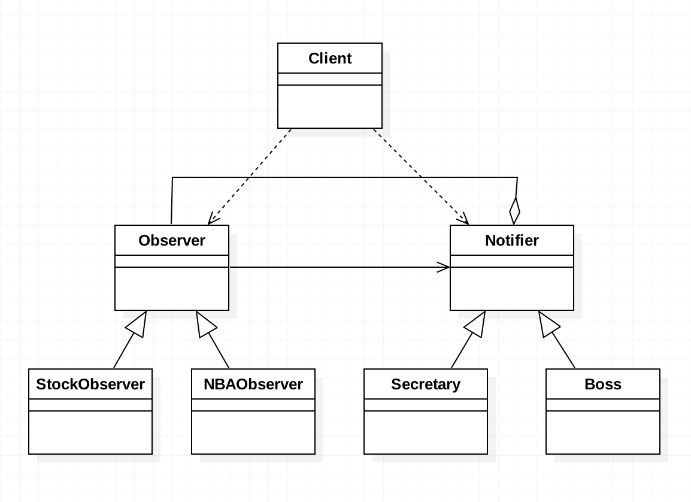
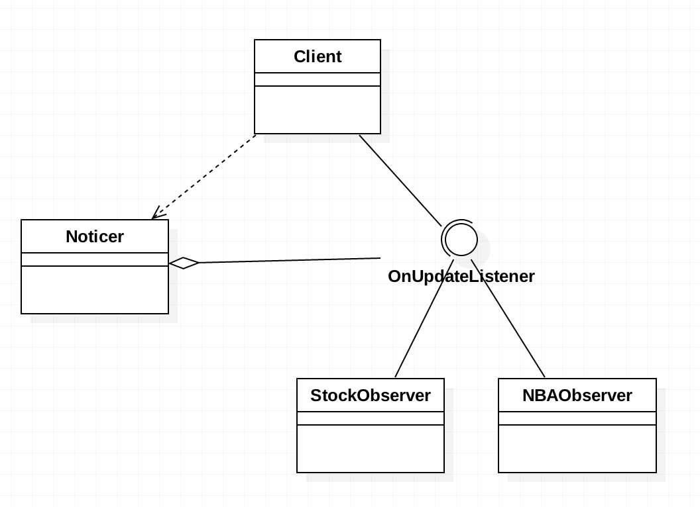

# 需求
办公室里有2个同事上班玩股票，他们"收买"了前台秘书，当老板回来时，秘书会通知他们老板回来了，以便他们装模作样。
（后来由于老板回来后安排秘书处理事情了，没来得及通知,结果被老板发现了）

# 分析
+ 典型的你中有我我中有你，大家都不直接面对，都向抽象。
+ 前台：1.将需要打招呼者添加到通知名单；2.当老板来时挨个通知到位。
+ 同事：1.上班看股票；2.接到前台通知恢复工作状态
+ 玩股票的观察者是具体的类(将来还可能有看NBA的人，玩游戏的人)，通知者也是具体的类(前台秘书，将来这些玩股票
  的可能还会请其他人帮忙监控老板的状态。老板在这里其实也扮演的通知者的角色，不管采用的是哪种方法，结果都是
  让员工回复工作状态了)。
+ 假设现在需求添加看NBA的观察者，增加老板这个通知者，怎么办？由于原先的代码我中有你，你中有我，双向耦合在一起了，
  所以不得不修改，不符合"开放-封闭原则"。根据依赖倒转原则，具体应该依赖抽象，现在将观察者和通知者分别抽象出一个
  接口(或抽象类)，然后具体的类都面向接口。
  
# 总结
+ 观察者模式:(订阅-发布模式)定义了一种一对多的依赖模式，让多个观察者对象同时监听某一个主题对象，这个主题对象
  在状态发生变化时，会通知所有的观察者对象，使它们能够自动更新自己。(本例中的主题对象就是小秘，老板回来了小秘
  的状态就变化了，并且会通知所有观察者，让它们自动更新)。观察者对象面向主题对象的抽象，主题对象面向观察者的抽象。
+ 什么时候用观察者模式？当一个对象的改变，需要同时改变其他对象，而且它不知道具体有多少对象待改变的时候，应该考虑
  用观察者模式。总之，观察者模式所做的工作就是解除耦合，让耦合的双方都依赖于抽象而不是依赖具体。 
+ 本项目demo01是Java开发常用方法，demo02是Android开发常用。  

# UML类图

	    
	    
	            
	    