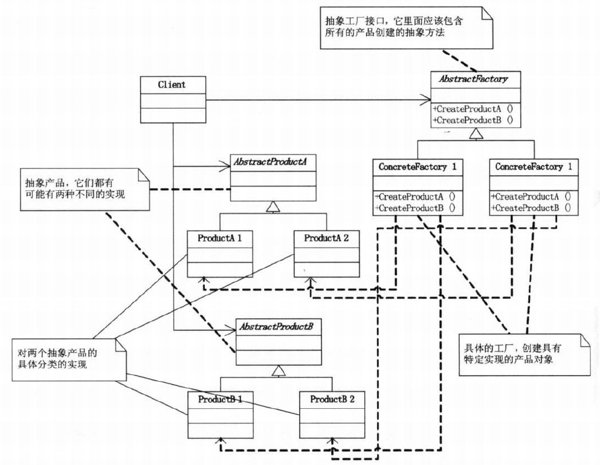
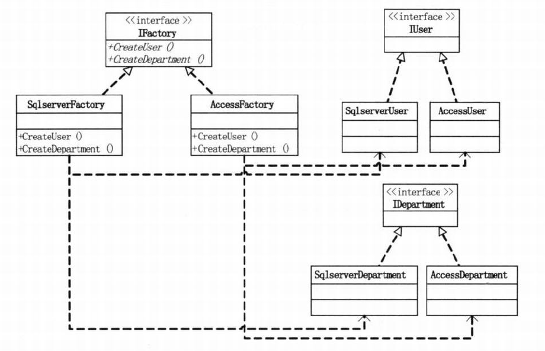
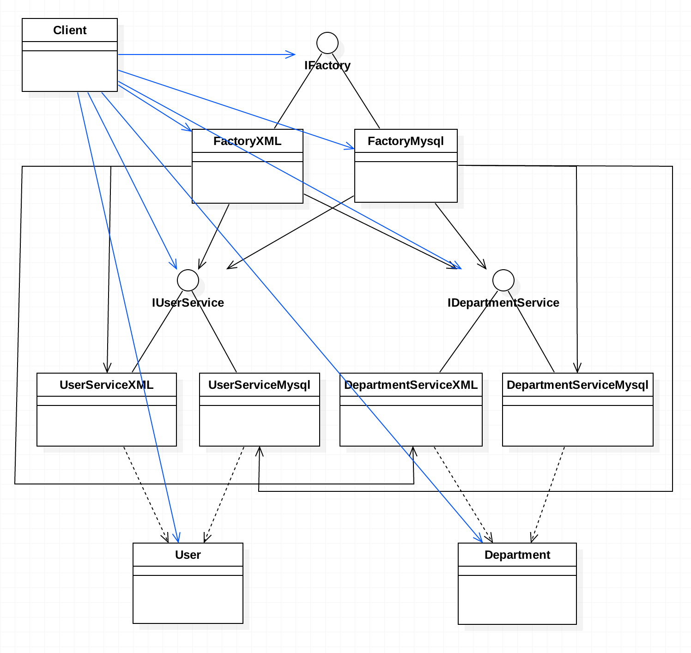

# 需求
同一个项目，既有XML作为数据库的访问情况，又有MySQL作为数据库的访问情况，要能自由切换。数据库里有2张表，一张user表，一张department表。 假设这两张表都只有两个字段，id和name。假设业务逻辑都只涉及"新增用户"和"根据姓名得到用户"这两个方法。

# 架构设计
1. 使用抽象工厂模式
	+ User：实体
	+ Department：实体
	+ IUserService: 接口 {void addUser();   User getUserByName(String name)}
	  + UserServiceXML
	  + UserServiceMysql
	+ IDepartmentService: 接口 {void addDepartment();   Department getDepartmentByName(String name)}
	  + DepartmentServiceXML
	  + DepartmentServiceMysql
	+ IFactory: 接口 {IUserService createUserService();  IDepartment createDepartmentService()}
	  + FactoryXML
	  + FactoryMysql 
    + 使用抽象工厂模式后,个各类之间均解耦，如果增加新的数据库，如Oracle数据库访问，只需要增加 UserServiceOracle，DepartmentServiceOracle，FactoryOracle即可。 
	  同样问题也有:
	  1. 类比较多，不过这个是次要，只要解耦，易维护易扩展易复用，这都不是问题。
	  2. 如果要新增的不是数据库，而是需求，比如修改数据库中用户信息的功能。  void updateUserInfo();则需要修改很多类，几乎所有的接口和类。
	  3. 每个客户端初始化时，要用具体的数据库，如 IFactory factory = new FactoryXML(); 一旦切换数据库，尽管只有这一句，但是我有100个客户端使用了这一句，那么就要修改100句，工作量就大起来了。
2. 简单工厂模式 + 配置文件
   + 考虑到类太多，而简单工厂的最大问题是决定实例化哪个类，在本例特定的环境下问题较小。可选择的实例只有2个，即使后期增加，也不可能很多，不可能要切换10个数据库吧？而且每种数据库都是非常明确的，也即是说"参数是很明确的"。这样第二版代码就出炉了。
   + 到这一步已经简化的差不多了，可以打95分了。但是还是有可以改进的地方，假如再增加Oracle数据库，还是需要修改代码，增加条件语句分支的。有没有办法不使用判断语句就可以达到实例化某个类的效果呢？有，那就是反射！  			

3. 简单工厂模式 + 配置文件 + 反射
   + 本例的特点:1.使用哪个数据库是由客户端说了算的，而且是非常明确的，可以访问前就指定。2.每次都是"多选一"，即只需从几个数据库中选择一个就可以了，也即只需实例化一个对象即可。
   + 反射机制创建对象的步骤:
     ~~~
	 Class clazz = Class.forName("全类名");            //参数为字符串型,且是完整路径
	 Constructor con = clazz.getConstructor(null);    //由于只有空参构造,所以比较简单的拿到构造函数
	 IUserService userService = (IUserService)con.newInstance(null);   //用拿到的构造函数创建实例
     ~~~
     	
   + 通过上述的步骤可以发现，用反射机制创建对象时，取决于第一步里的参数，而最重要的是这个参数还是字符串类型的，即意味着，可以用一个变量表示，更进一步，可以写在配置文件里，用ResourceBundle 去获取。到此为止，可以打100分了，因为即使增加Oracle进来，只需要做这么几件事:1.增加UserServiceOracle类，DepartmentOracle类，2.修改配置文件中的类名。不需要修改其他类及工厂类，完全解耦。新增需求完全是通过新增代码(配置文件不算)完成的，完全符合"开放-封闭原则"。但是如果要新增功能，如修改用户信息，删除用户等，还是需要修改代码的，从接口修改起，这是业务逻辑发生改变造成的，是没办法避免的。
		

# 总结 
1. 抽象工厂模式(Abstract Factory)，提供一个创建一系列相关或者相互依赖的对象的接口，而无需指定它们具体由哪个类来创建。
2. 抽象工厂模式虽然耦合性更低，但并非一定更好用，要根据业务需求及特性来制定。简单工厂适合产品种类明确、较稳定、较少的场景，而抽象工厂则更适合产品种类不明确、不稳定、很多的场景。
3. 通过反射，回避实例化对象时的条件分支语句，是一种很实用的技巧。

# UML类图

