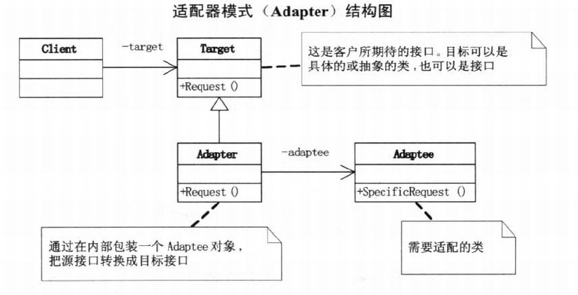
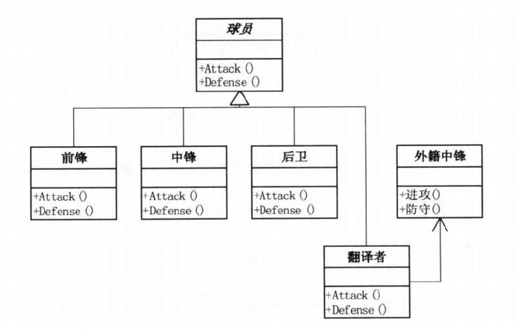
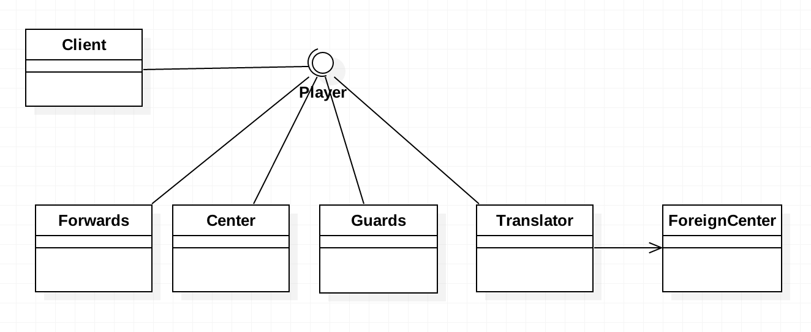

# 需求背景
姚明初入NBA时英语并不好，教练指挥战术时，姚明需要带一个翻译。由于姚明短时间内无法将英语提高到应用自如的水平，
而让教练说中文也不太现实，所以翻译就显得非常重要。将上面的场景用适配器模式表达出来！

# 需求分析
典型的应用场景：需要的东西就在眼前，但却不能直接使用，而短时间内却又无法改造它，于是我们想办法来适配它。 举一个
生活的例子，有些国家的电压是110V，有些国家是380V，而我们国家是220V，当我们使用某些国外的产品时，我们的电压不符合
它的需要，因此这些产品还会提供一个叫电源适配器的东西，将我们的220V电压转换成它自己需要的电压。上面的例子中，姚明
作为一个外籍球员，就是需要适配的类，而美国国内球员就是目标接口，而翻译就是适配器类。

# 适配器模式	
+ 将一个类的接口转换成客户希望的另外一个类的接口。Adapter模式使得原来由于接口不兼容而不能一同工作的那些类可以一起工作。
  适配器模式主要应用于希望复用一些现存的类，但是接口又与复用环境不一致的情况。
+ 什么时候用适配器模式?
  + 系统的数据和行为都正确，但接口不符时可以考虑使用适配器模式，目的是使控制范围之外的一个原有对象与某个接口匹配。
  + 两个类所做的事情相同或相似，但具有不同的接口时可以考虑使用它(双方都不太容易修改）。
  + 如果修改接口很简单，所造成的影响也不大，应首先考虑重构代码，使接口统一，这样可以让代码看上去更简单、更直接、更紧凑。
+ 注意，使用适配器模式是一种无奈之举，能重构的情况下尽量重构，无法改变现有设计时才使用它。我们实际开发中，应尽量做到
  事前控制，事前预防、事中重构、事后适配。

# UML类图

