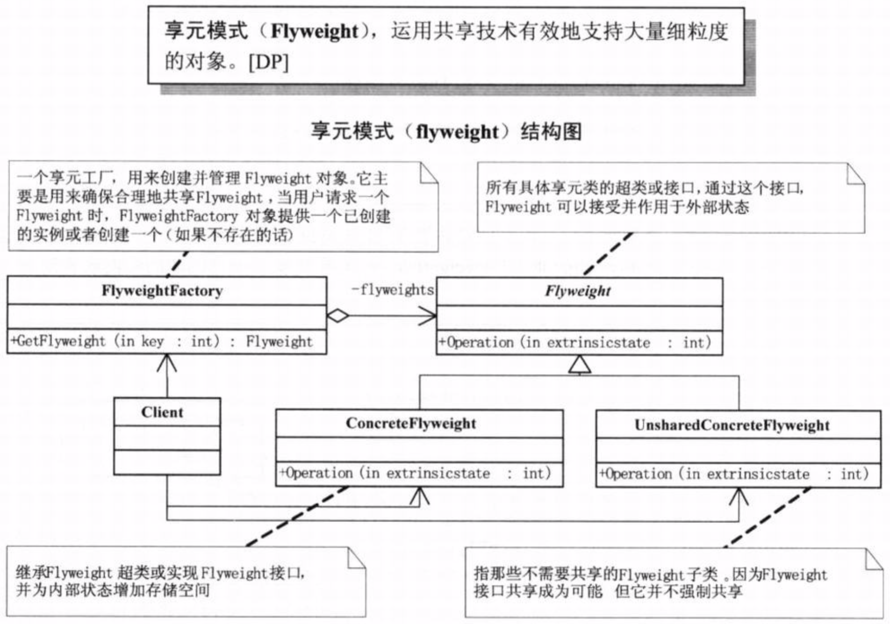
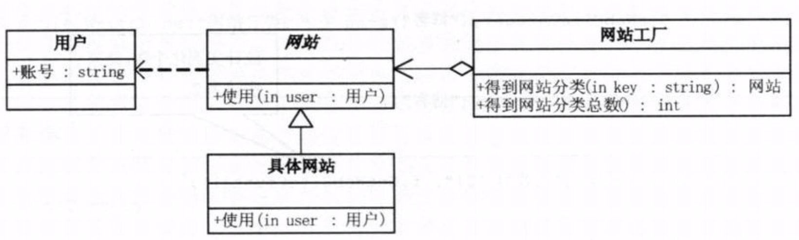

# 需求背景
租用虚拟空间给客户做网站，刚开始只是一个产品展示类网站，后来又有新的客户需要同类型网站，再后来又出现了博客类、论坛类等网站。如果每个网站都租一个空间，成本太高。

# 需求分析
由于这些企业客户所需要的网站结构相似度很高，而且都不是那种高访问量的网站，如果分成多个虚拟空间来处理，相当于一个相同网站的实例对象很多，会造成服务器资源的大量浪费。如果整合到一个网站，共享其相关的代码和数据，那么对于硬盘、内存、CPU、数据库空间等服务器资源都可以达成共享，减少服务器资源，而对于代码，由于是一份实例，维护和扩展更加容易。

# 享元模式
+ 定义：运用共享技术有效地支持大量细粒度的对象。
    
+ 伪代码：参考demo01    

# 代码架构
+ 按照享元模式设计第一版代码(demo02)，通过WebSiteFactory生成各种不同类型网站实例对象，基本导到了共享的目的。但是，就算同为产品展示类网站，不同的企业客户所需展示的内容是完全不一样的，这就需要区分内部状态和外部状态。
> 在享元对象内部并且不会随环境改变而改变的共享部分，可以称为享元对象的内部状态，而随环境改变而改变、不可以共享的状态就是外部状态。事实上，享元模式可以避免大量非常相似类的开销。在程序设计中，有时候需要生成大量细粒度的类实例来表示数据。如果能发现这些实例除了几个参数外基本都是相同的，有时候就能够大幅度地减少需要实例化的类的数量。如果能把那些参数转移到类实例的外部，在方法调用时把它们传递进来，就可以通过共享大幅度地减少单个实例的数目。也就是说，享元模式 Flyweight 执行时所需的状态是有内部的也可能有外部的，内部状态存储于 ConcreteFlyweight 对象之中，而外部对象则应该考虑由客户端对象存储或计算，当调用Flyweight对象操作时，将该状态传递给它。

+ 改进后第二版代码(demo03)，增加了一个User类，用于存储外部状态。
    
    
# 使用场景
+ 如果一个应用程序使用了大量的对象，而这些大量的对象造成了很大的存储开销时就应该考虑使用。
+ 对象的大多数状态可以外部状态，如果删除对象的外部状态，那么可以用相对较少的共享对象取代很多组对象，此时可以考虑用享元模式。
+ 享元模式更多的是一种底层设计模式，但现实中也有应用的。如围棋、五子棋、跳棋等休闲小游戏。围棋、五子棋只有黑白两色，跳棋颜色多一点，但也不是太变化的，所以颜色应该是棋子的内部状态，而各个棋子之间的差别主要就是位置的不同，所以方位和坐标应该是棋子的外部状态。
> 一个围棋棋盘有361个位置可以放棋子，如果采用常规的面向对象方式编程，每个棋盘可能都有300多个对象产生，一台服务器很难支持更多的玩家玩围棋游戏了，毕竟内存空间是有限的。如果采用享元模式来处理，那么棋子对象就可以减少到只有2个实例。

#缺陷
享元模式可以运用共享技术有效地支持大量细粒度的对象，但是使用享元模式需要维护一个记录了系统已有的所有享元的列表，而这本身也需要耗费资源，另外，享元模式使得系统更加复杂。为了使对象可以共享，需要将一些状态外部化，这使得程序的逻辑复杂化。因此，应当有足够多的对象实例可供共享时才值得使用享元模式。