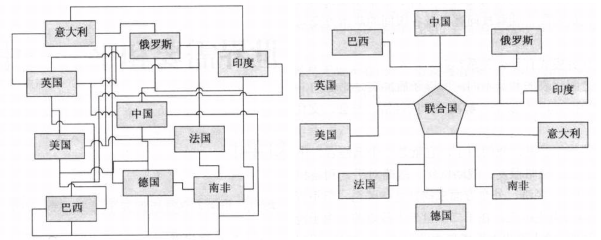
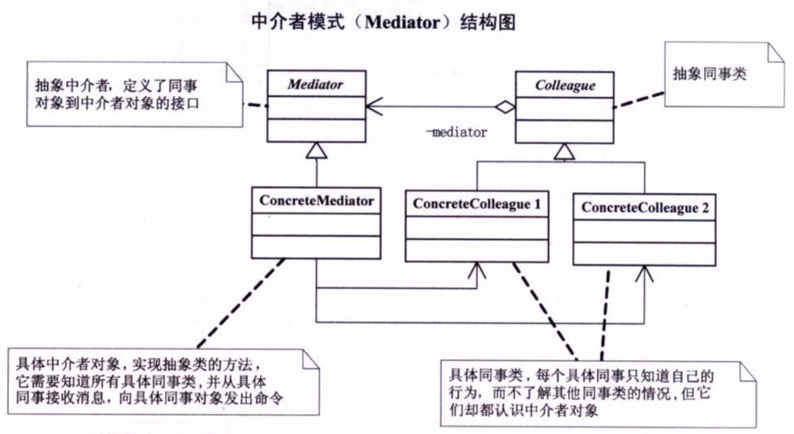
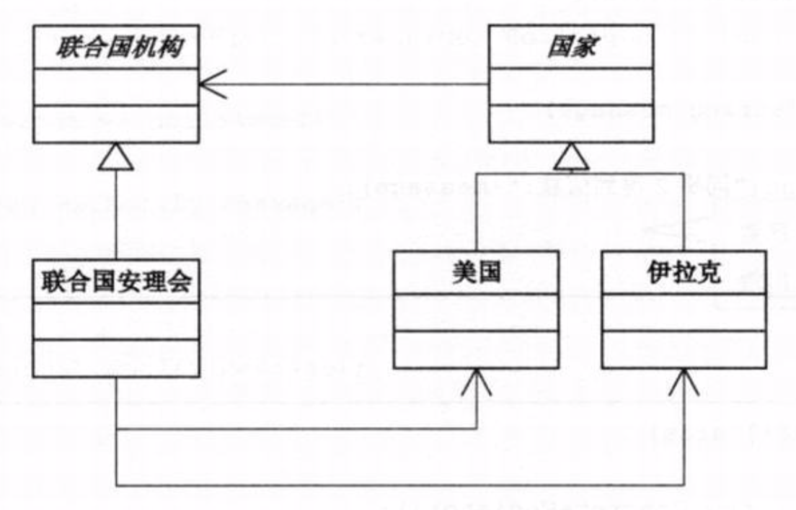

# 需求背景
1. 一个新上班的员工，由于人生地不熟，一般是很难要求另一个同事帮助做一些事情的，但是他可以请求部门经理去协调。
2. 国家与国家之间可以通过诸如联合国这样的全球性机构来沟通交涉问题。

# 结构设计
迪米特原则告诉我们，如果两个类不必彼此直接通信，那么这两个类就不应当发生直接的相互作用。如果其中一个类需要调用另一个类的某个方法的话，可以通过第三者转发这个调用。
本例1、2两个需求，分别参考伪代码:demo01、demo02。

# 中介者模式
+ 中介者模式(Mediator)，用一个中介对象来封装一系列的对象交互。中介者使各对象不需要显示地相互引用，从而使其耦合松散，而且可以独立地改变它们之间的交互。

+ UML结构图

+ 优缺点
  + 优点：Mediator的出现减少了各个Colleague的耦合，使得可以独立地改变和复用各个Colleague类和Mediator，比如任何国家的改变都不会影响其他国家，而只会与联合国安理会发生变化。其次，由于把对象如何协作进行了抽象，将中介作为一个独立的概念并将其封装到一个对象中，这样关注点就从对象各自本身的行为转移到他们之间的交互上来，也就是站在一个更宏观的角度看待问题。

  + 缺点：由于ConcreteMediator控制了集中化，于是把交互复杂性变为了中介者的复杂性，这就使得 ConcreteMediator 比任何 ConcreteColleague 都复杂。

  > 中介者模式很容易在系统中应用，也很容易在系统中误用。当系统出现了"多对多"交互复杂的对象群时，不要急于使用中介者模式，而要先反思你的系统设计上是否合理。

+ 应用场景
  中介者模式一般用于一组对象以定义良好但是复杂的方式进行通信的场合（比如计算器的各个按键），以及想定制一个分布在多个类中的行为，而又不想生成太多子类的场合。