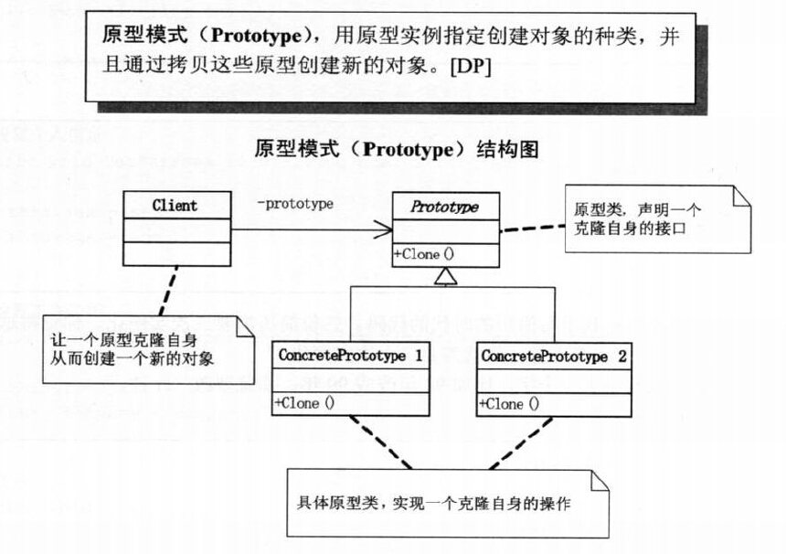
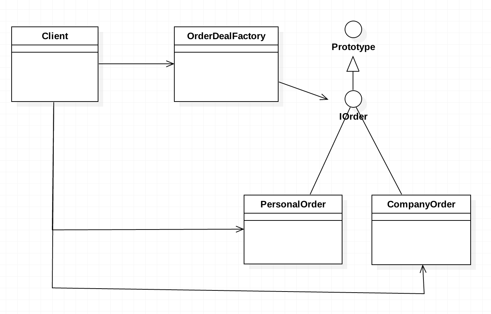

# 需求背景
由于要找工作，需复制多份简历，写一个简历生成程序。

# 需求分析
+ 思路1：直接new对象，然后复制粘贴代码。
  + 缺点1：需要几份简历，就需要实例化几次。
  + 缺点2：如果第一份简历错误，那所有的简历都需要修改。
+ 思路2：Resume r2 = r；Resume r3 = r 
  + 实际上只实例化一个对象，如果出现错误，只需要修改r即可。这实际上就是一种设计模式思想----原型模式.
+ 原型模式其实就是根据一个对象创建另外一个可定制的对象，而且不需要知道任何创建的细节。
  (方法:实现java.lang包里的Cloneable接口或者自己写一个Prototype接口）
+ 原型模式可以分为浅表复制和深层复制，浅表复制原型和副本任何一个调用set方法改变自身属性，
  则所有副本均会发生改变。深层复制所有对象相互独立，改变原型或某个副本的属性不影响其他对象。

# 原型模式
用原型实例指定创建对象的种类，并且通过拷贝这些原型创建新的对象。

# UML类图

