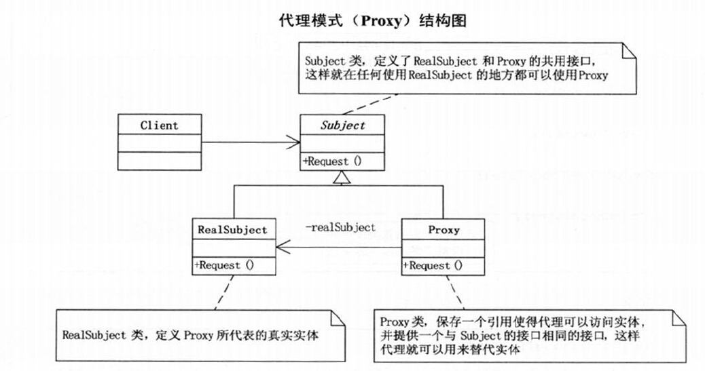
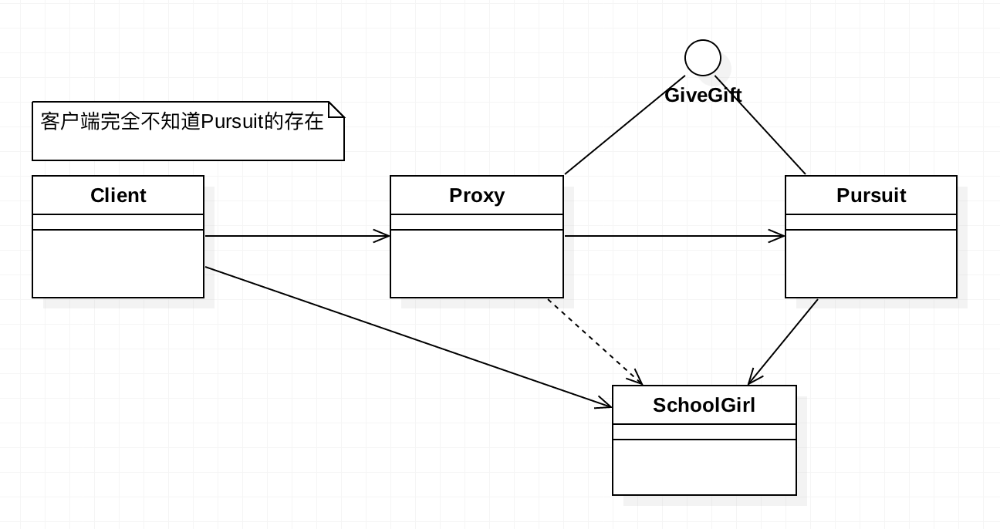
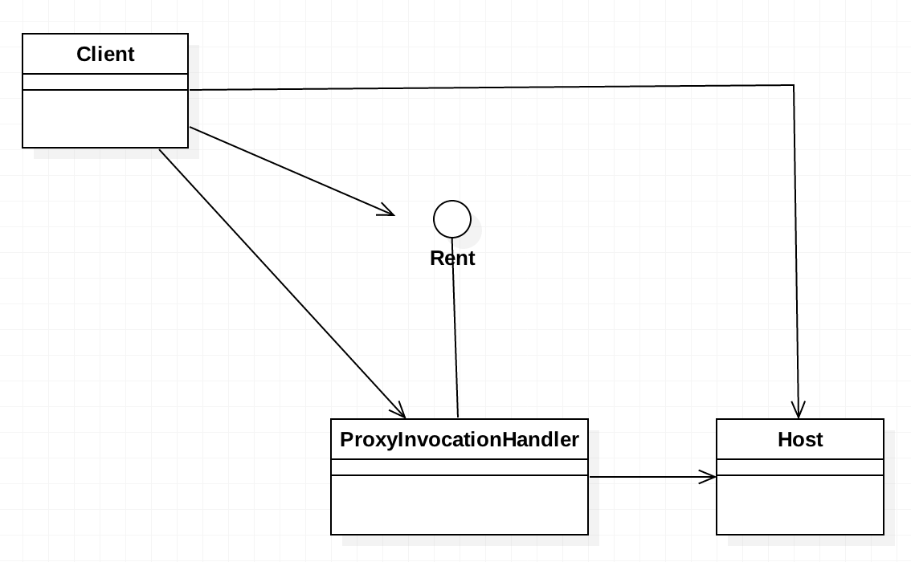

# 需求
卓贾谊不认识李娇娇，但是卓贾谊的好哥们戴利和李娇娇是同班同学，卓贾谊想追求李娇娇，	于是通过戴利向李娇娇送芭比娃娃，
送鲜花，送巧克力。写一个程序体现这种逻辑关系。

# 需求分析
1. 涉及到的对象：卓贾谊、戴利、李娇娇.
2. 人物之间的关系，卓贾谊和戴利相互认识，戴利和李娇娇相互认识，但是卓贾谊和李娇娇相互不认识。
3. 属性：都有姓名属性。
4. 行为：送芭比娃娃，送鲜花，送巧克力。

# 基本设计(静态代理)
### 阶段一
直接写定义两个类，分别是追求者，被追求者，然后追求者向被追求者展开追求行为（代码过于简单，脑补）。 
问题：人物关系没弄清楚，第一版代码反映的是卓贾谊亲自向李娇娇送礼物，但是实际情况是两者互相不认识的。
                        
### 阶段二
在阶段一的基础上，将类名改成了Proxy，其他的不变。然后客户端运行时，将name改成里"戴利"，其他代码不变（代码过于简单，脑补）。 
问题：与实际需求不符，变成了戴利追求李娇娇。
	
### 阶段三
由于追求者(卓贾谊)，代理者(戴利)都具有相同的功能，送芭比娃娃，送鲜花，送巧克力。所以他们应该实现了一个共同的接口（送礼物接口）。
追求者不能直接送礼物，但是可以通过代理对象达到送礼物的目的，因为代理者也实现了送礼物的接口，不同的是它的底层调用的追求者的方法。 
第三版代码的特点（本例）:
1. 从客户端看不出真正送礼物的人是谁。表面只能看到代理者戴利在送礼物，但底层实际上是卓贾谊在送。
2. 追求者和代理者实现了同一接口，不同的是代理者在其构造函数内部，创建了一个追求者(委托者)的实例，它的各种赠送行为其实是调用的
   追求者的相关方法。
3. 看上去和装饰设计模式很像，但是两者是有区别的：
   1. 装饰器模式专注于在一个对象上动态的添加新功能，然而代理模式专注于控制对象的访问权限。
   2. 装饰模式不需要对外隐藏其信息，所以通常在外部创建实例，然后将实例作为参数传递给装饰类。而代理模式通常需要隐藏被代理的对象，
      所以要在代理类的构造函数内部去创建一个被代理类，换句话说，代理类（proxy）可以对它的客户隐藏一个对象的具体信息。
   3. 使用代理模式，代理对象和真实对象之间的的关系通常在编译时就已经确定了(被代理类的实例创建在代理类内部)，而装饰模式者能够在
      运行时递归地被构造(多层包装)，可以方便的随时改变包装次序和形式。代理模式尽管也可以被多重代理,但是不能客户端不能随意变动。
4. 本例只是纯粹的代理，代理者没有给被代理的行为添加其他功能，但是这是允许的，和装饰设计模式一样，可以增加一些内容的。

# 动态代理
1. 动态代理是基于接口的。只要一个类实现了某个接口，那么我们就可以动态代理它的所有接口方法。
2. 使用到了java.lang.reflect包下的接口InvocationHandler，是代理对象的调用处理程序实现的接口。每个代理对象都具有一个关联的调用处理程序，
   对代理对象调用方法时，将对方法调用进行编码并将其指派到它的调用处理程序的 invoke 方法。我们可以在invoke()方法内部做一些处理，比如打日志，
   计算运行时间等等。
3. 动态代理一般用于AOP，用于批量切入一些操作；

# UML类图
+ 标准UML：

+ 静态代理实例UML：

+ 动态代理实例UML：
