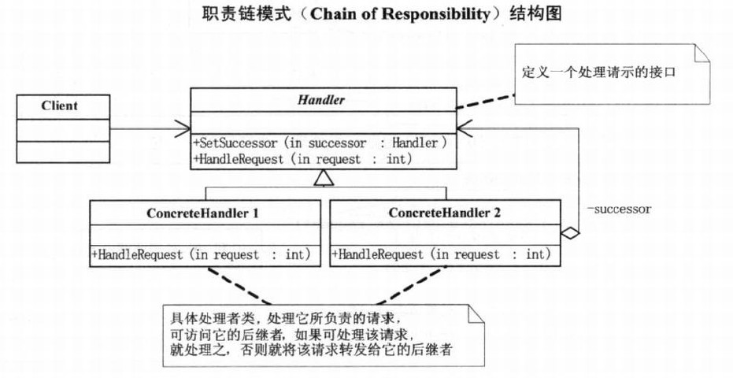
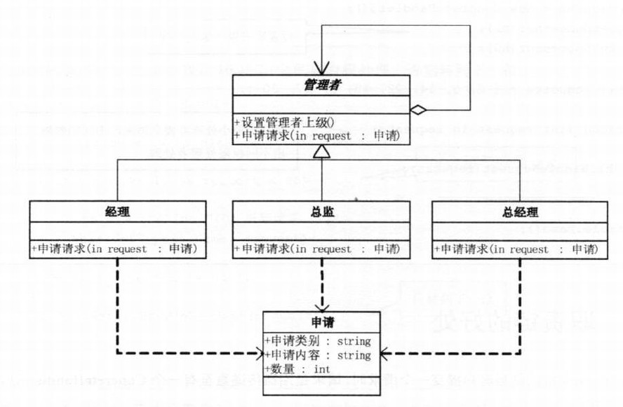
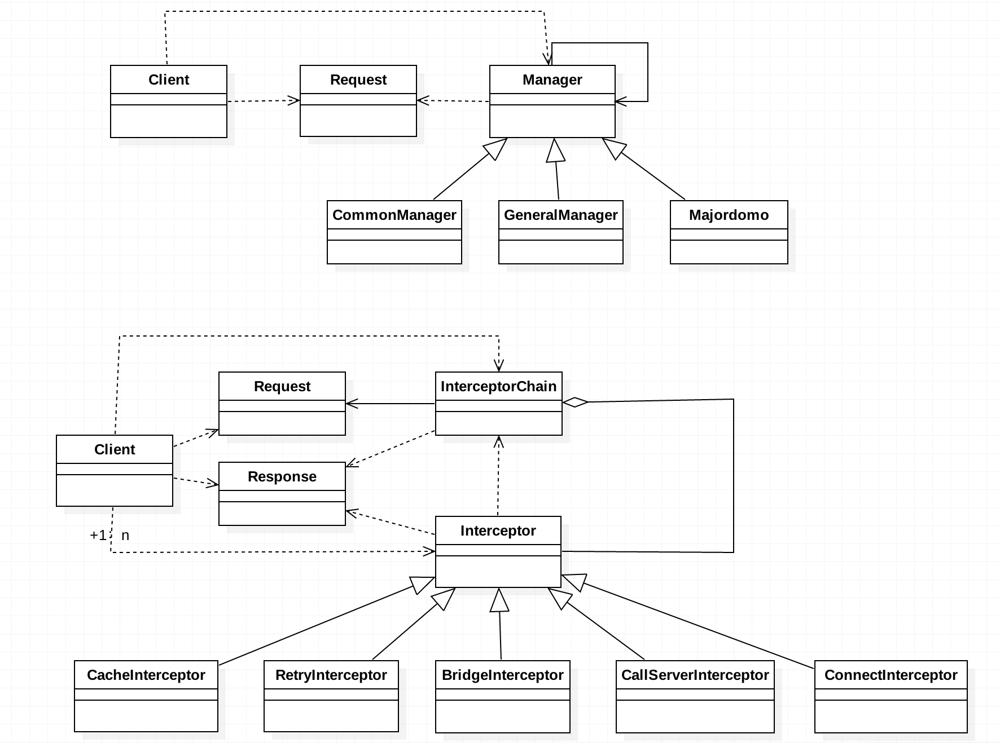

# 需求
1. 给公司设计一个申请报告的流程，参与对象普通经理、总监、总监理。不同对象拥有的权限不同。
2. 模仿OKHttp框架网络请求处理过程（拦截器、责任链）

# 分析
这两个需求虽然不同，但是都有一个共同点，就是同一个请求可以被多个对象处理，并且有一定的处理顺序。比如
+ 需求1，申请报告的审批流程一般是客户端提交---普通经理---总监---总经理。
+ 需求2，OKHttp处理网络请求是通过一系列拦截器有序来完成的，重试与重定向拦截器---配置请求头拦截器---处理缓存拦截器---
  连接服务器拦截器---执行IO操作拦截器。
  
这两个需求都形成了一种链条的结构，不同的是前者链条上只要有一个节点处理了，则请求结束，后者必须链条上的每个节点都处理一遍。  

# 基本设计
需求1的伪代码见demo01包，需求2的伪代码见demo02包。

# 责任链模式
 职责链模式：使多个对象都有机会处理请求，从而避免请求的发送者和接收者之间的耦合关系。将这些对象连成一条链，并沿着这条链传递该请求，
 直到有一个对象处理它为止。
+ 好处？请求的发送者与处理者之间解耦。这里发出请求的客户端并不知道最终处理请求的是谁？这样系统的更改可以在不影响客户端的情况下
  重新组织和分配责任。
+ 使用场景？当提交一个请求，该请求根据某些标准划分，不同水平的请求，处理的对象也不同，并且提交请求的一方并不需要知道最终是谁
  处理了该请求时，可以考虑用职责链模式。
+ 职责链模式的几个要点:
	1. 客户端并不需要知道最终是谁处理了它的请求，处理的一方也可以不清楚客户端的存在。
	2. 职责链条的设定在客户端，因此客户端非常灵活，可以修改请求传递路径。
	3. 链条上的每一个处理请求的对象，都需要通过判断，明确哪些请求不可推卸，哪些请求必须要推卸(上报)，所以要明确当前对象处理
	   不了时，其后继者是谁?
	4. 作为对第3点的补充，一是有些场景下并不需要显示指明后继者，而是通过维护一个有序的集合来隐性的指明，比如OKHttp处理网络
	   请求的过程。二是在链条的每个节点处理业务逻辑时，也并不一定需要判断它是否具有处理权限，这是因为默认链条上的每个节点都
	   是必须执行的，并且它们各自执行的业务完全不一样，分工非常明确，这也是责任链模式使用的一个常用的场景。
  			
# UML类图

