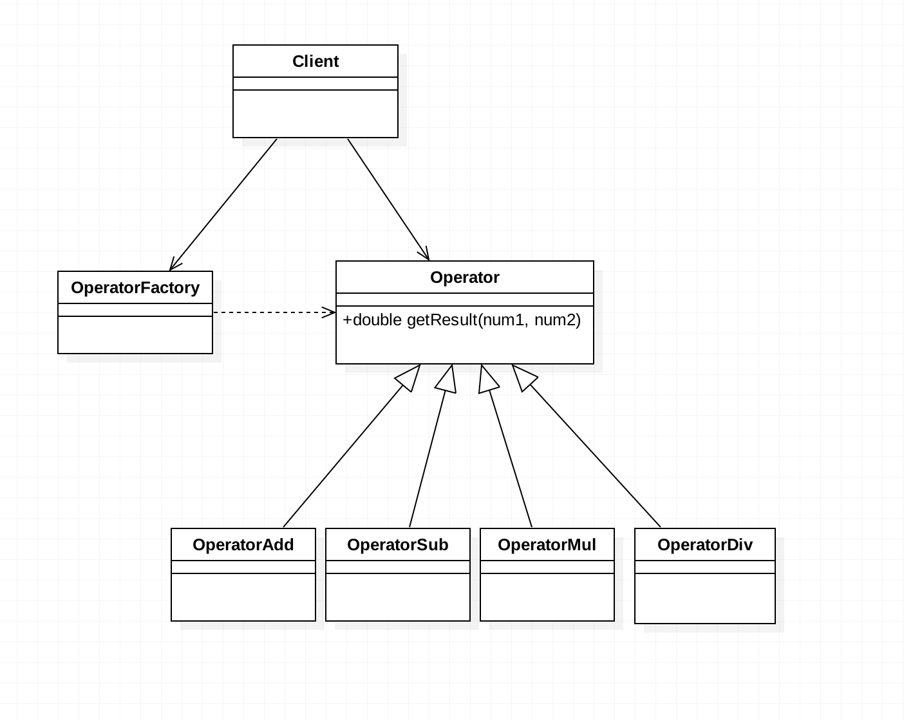

# 需求
设计一个计算器程序,要求输入两个数及运算符,就可以获取运算结果。

# 基本设计
代码见basic包。
#### 点评:
1. 基本达到了计算器的要求。
2. 业务逻辑和显示逻辑没有区分开。只有分离开才能达到易维护和易扩展。
3. 没有用面向对象的三大特性：封装、继承、多态。如果要扩展其他运算，需要在源代码上增加if分支，比如增加一个平方运算，却需要加减乘除都得来参与编译。如果一不小心，
还容易将运行良好的代码搞错。其次，将不必要的代码对外提供，还会造成危险性，就好比增加一个兼职人员的薪资计算方式，按照上面的思路需要将其他各类员工的计算方式一起提供出去，不安全。
4. 解决:定义一个运算类，它是一个抽象类(定义成接口也可以)，给它定义一个抽象的运算方法，然后将每种运算都单独封装为一个类。分别去继承该抽象类,但是要重写其方法.
  			
  			
# 改善设计 
1. 通过向上抽取运算类，以及创建子类，使各个运算之间解耦。现在要单独修改某个运算的算法，只需要进入对应的类修改即可。而如过需要增加运算，如平方根算法等，则创建新的运算类去继承抽象类即可。
2. 现在面临到底去实例化谁的问题了，这就引入了重头戏"简单工厂模式"。通过传递给工厂参数,由工厂去实例化对应的运算类。

# UML类图
