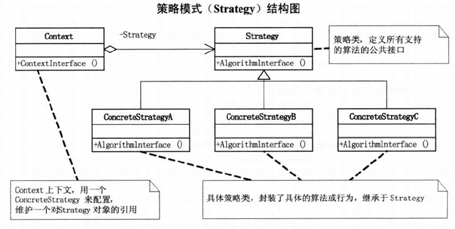
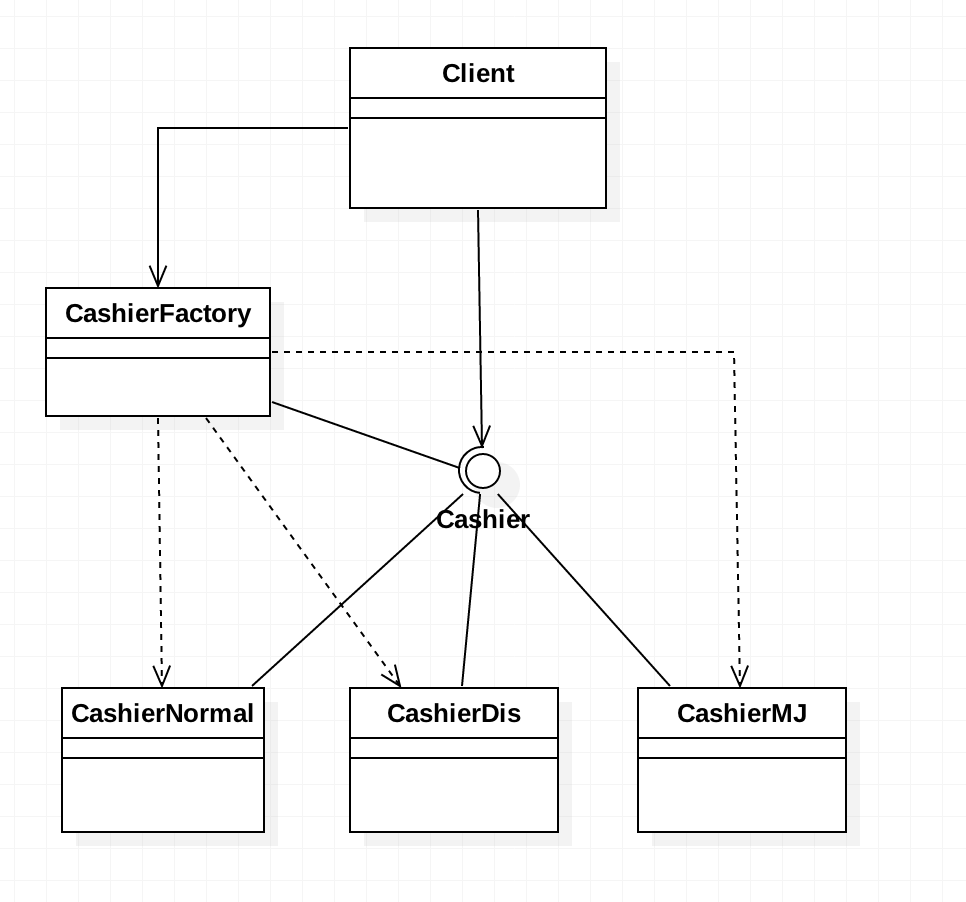
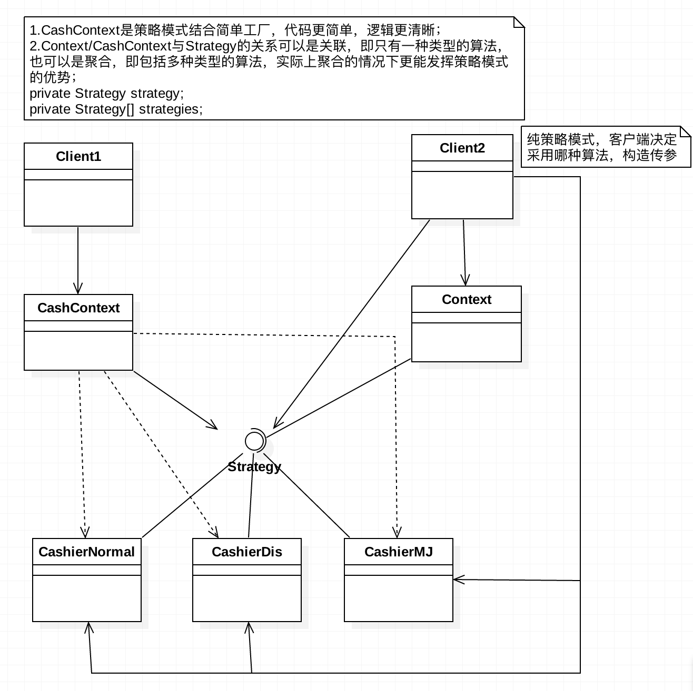

# 需求
要求设计一个商场收银软件，输入购买商品的单价和数量，就可以计算总收费应该是多少。

# 思路
由于有了之前简单工厂模式的基础，知道不能简单的设计一个运算类，因为计算方法变化性太强，商场后期可能要促销，如打9折，打8折，打7折，满300减100，满500减200之类。
 + 进阶一：按照简单工厂模式的思路，定义一个抽象的运算类，然后将每种运算单独定义为一个运算子类去继承它，最后再来个简单工厂来产生需要实例化的子类对象，用父类接收。
 + 进阶二：考虑到打9、8、7折属于一类运算方式，满300减100、满500减200也属于同一类型的运算方式，所以并不需要每一种促销折扣都单独创建一个类，一种促销模式设计一个类即可。
   现在先按照这个思路设计一下。
     
# 改善设计   
 + 基本策略模式：不管是打折也好，满减也好，积分也好，都只是一种促销算法，我们不面对具体的算法，而面对由它们聚合而成的类Context，也叫算法家族。
   至于选择使用哪种促销算法，交给客户端去判断。
 + 同时做一个小小的优化，之前一直将参数price，num等由客户端提供，是为了减少其他各个算法类对获取配置文件信息的重复，但是考虑到开发系统的目的
   就是减轻客户端的压力，所以还是这一步骤还是应该由后台来做，由于每个算法都需要进行这一步，所以考虑抽取到一个工具类中方便调用。 
 + 对比简单工厂模式，可以看到，客户端只用面对一个算法家族类Context即可。但也有一个缺陷，到底采用哪种策略，交给了客户端，应该优化一下,可以将策略模式和简单工厂模式组合一下。
 + 策略模式：定义了算法家族，分别封装起来，让它们之间可以相互替换，此模式让算法的变化，不会影响到使用算法的客户。
 + 假如现在新需求来了，需增加一个满100元积分10点的功能，后期可以凭积分兑换礼品。按照之前的思路，可以新增一个"积分计算"的运算类。可以让它去继承Cashier这个类，
   然后在收费对象生成工厂里增加一个条件分支，这的确可以解决问题。

# 对比简单工厂模式和策略模式
 1. 客户端代码：简单工厂模式客户端需要认2个类，Cashier，CashierFactory，而策略模式，客户端只需要认CashContext这一个类即可，所以耦合性更低。
 2. 策略模式解析：策略模式是一种定义一系列算法的方法，从概念上看所有的这些算法完成的都是相同的工作，只是实现不同，它可以以相同的方式调用所有的算法，减少各种算法类与使用算法类之间的耦合。
 3. 策略模式的Strategy类为Context类定义了一系列可供重用的算法或行为，继承有助于吸取出这些算法中的公共功能。
 4. 策略模式的另一个优点是简化了单元测试，因为每个算法都有自己的类，都可以单独测试。
 5. 策略模式封装了变化，策略模式就是用来封装算法的，但在实际开发中我们发现，可以用它来封装几乎任何类型的规则，只要遇到需要在不同的时间应用不同的规则，就可以考虑用策略模式来处理这种变化的可能。
 6. 简单工厂模式只是解决了对象实例化的问题，工厂本身包括了所有的收费方式，但是商场可能经常性的更改折扣方式和返利额度，每次维护和扩展都要改动这个工厂，以致代码需要重新编译部署，这显然不是最好的办法。
    面对算法经常变动，应该用"策略模式"---Strategy。

# UML类图

