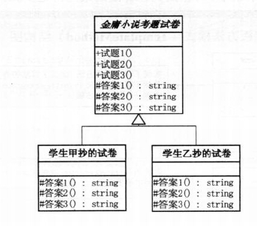
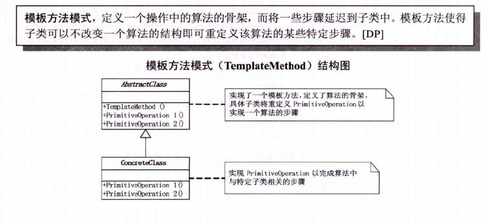

# 需求
A、B两个学生做同一份试卷，试题全是客观题（选择题），但是A、B可能会交出两份不同的答卷来。

# 分析
试卷由试题和答案组成，由于A、B做的是同一份试卷，所以试题应该是一致的。而每道题的答案则很可能不同，因为
个人的能力水平不同。这个需求主要考察的是封装变化、向上抽取的能力。

# 基本设计
本例比较简单，因此简要说明一下。这里通过demo01、demo02、demo03进行代码的演变，体会封装变化、抽象的思想。
+ demo01是最原始的代码，显示TestPaperA和TestPaperB高度重复，由于试题内容完全相同，因此向上抽取一个父类。
+ demo02是重构过一次的代码，将相同的试题部分抽取到父类中了，代码上简洁了不少，但是仅仅算是入门级而已，我们
  注意到两份试卷，变化的仅仅是A、B、C、D 而已，其他地方几乎一模一样，并且由于试卷完全相同，所以试题的顺序
  也应该完全相同，我们完全可以再次向上抽取从而得到demo03。
+ demo03将所有不变的行为全部抽取到父类中去了，子类中只包含变化的部分。抽象出来的父类，就相当于是一个模板。  

# 模板方法模式
+ 模板方法模式：定义一个操作中的算法骨架，而将一些步骤延迟到子类中。模板方法使得子类可以不改变一个算法结构
  即可重定义该算法的某些特定步骤。
+ 模板方法模式是通过把不变的行为搬移到超类，去除子类中的重复代码来体现它的优势。说白了，模板方法模式就是提供
  了一个很好的代码复用平台。但是要注意一点：凡是相同的部分一定要放在模板中，子类中的一定是不同的部分，只有这样
  才能最大程度的提高代码的复用性。
+ 使用场景：当我们要完成在某一细节层次一致的一个过程或一系列步骤，但其个别步骤在更深层次上的实现可能不同时，
  我们通常考虑用模板方法来做。
+ 当不变和可变的行为在方法的子类实现中混合在一起的时候，不变的行为就会在子类中重复出现，我们通过模板方法模式
  把这些行为搬移到一个单一的地方，这样就帮助子类摆脱重复的不变行为的纠缠。
+ 一句话为了提高代码的复用性：模板定骨架、子类封变化；封装数据用对象、封装行为用接口。 		
 	
 	
# UML类图

