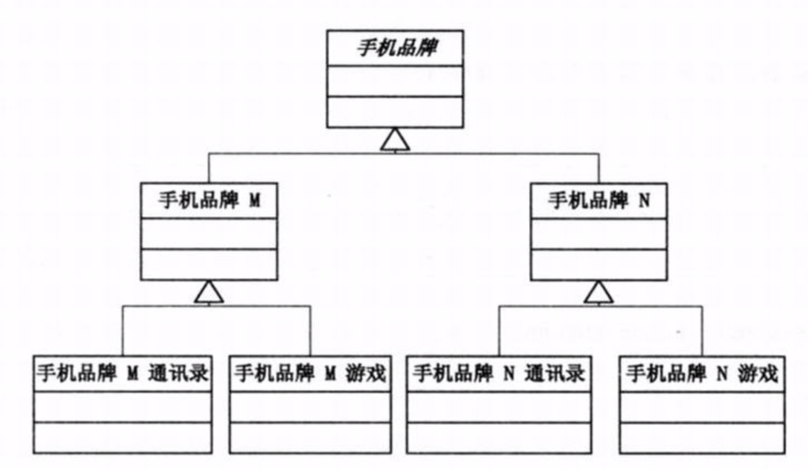
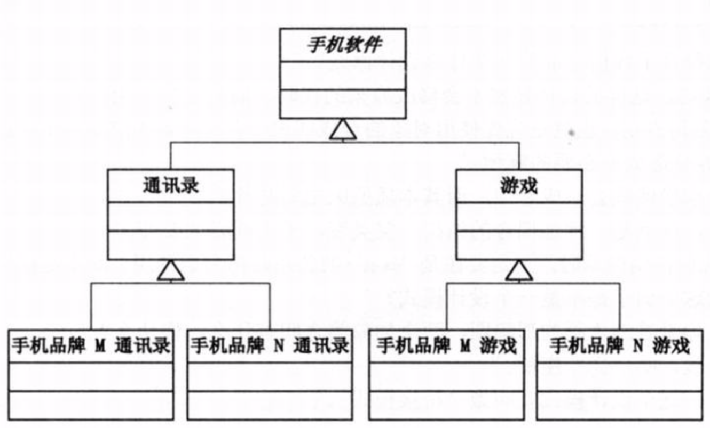
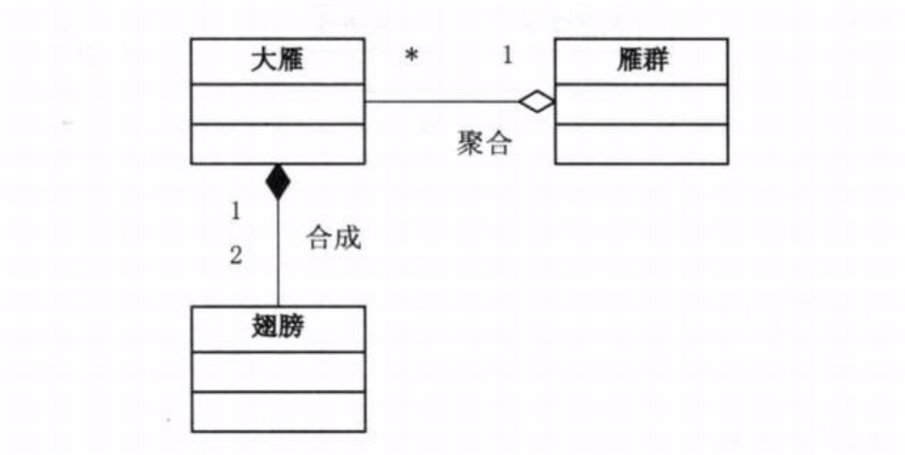
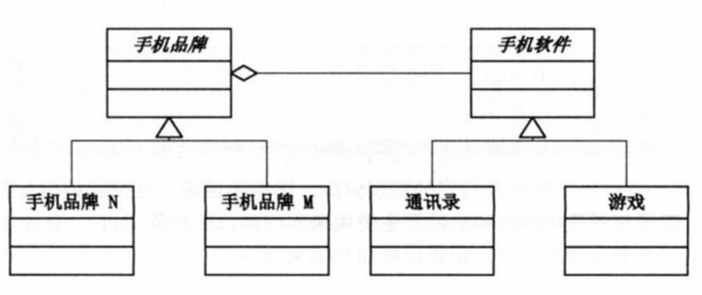
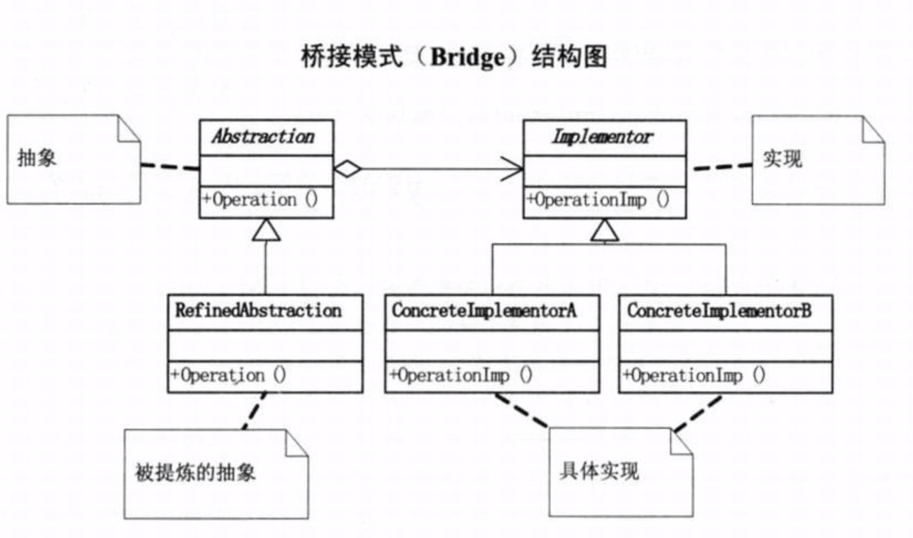

# 需求背景
对于PC而言，由于有了Windows操作系统，使得所有的PC厂商不用关注软件， 而软件制造商也不用过多关注硬件，这对计算机的整体发展是非常有利的。但是对于手机而言，各大手机厂商一般都有自己的软件开发部门开发软件(系统自带软件)，哪怕是同一品牌手机的不同型号，也完全有可能不兼容。以游戏和通讯录程序为例，品牌A和品牌B完全不一样，本项目通过伪代码来描述这一现象。

# 结构设计
1. 以手机品牌为抽象(按手机品牌分类)
   
   缺陷：
    + 当新增加一个手机品牌T时，T需要将所有游戏挨个实现一遍，也就是要增加（1 + 软件款数）个类；
    + 当新增加一款手机软件时，我们需要对所有手机品牌新增一个实现类，需增加(手机品牌数)个类； 
      
   
    不管是上面那种情况发生，都不是我们想要的结果。因为随着手机品牌或者软件数量的增加，我们的结构体系会变得非常庞大！ `伪代码参考demo01`
   
2. 以手机软件为抽象(按手机软件分类)
   
   缺陷：
    + 当新增加一款手机软件(如Mp3)时，需要将所有手机品牌挨个实现一遍，也就是要增加（1 + 手机品牌数）个类；
    + 当新增加一个手机品牌时，我们需要对所有手机软件新增一个实现类，需增加(手机软件款数)个类； 
      
   
    不管是上面那种情况发生，也都不是我们想要的结果。同样会随着手机软件或者品牌数量的增加，我们的结构体系会变得非常庞大！`伪代码参考demo02`
   
1. 上述两种结构设计产生缺陷的原因
    + 就本例而言，抽象设计存在两种方式，按手机品牌抽象或者按手机软件抽象，后续变化的产生基本也是源于这两个方面，如新增手机品牌或者新增手机软件种类。
    + “有了新锤子，所有东西在眼里都变成了钉子”。学了面向对象设计之后，只要遇到可以抽象的地方最容易想到的就是继承，但是很多情况下用继承会带来麻烦。比如，对象的继承关系在编译时就定义好了，所以无法在运行时改变从父类继承的实现。子类的实现和它的父类有非常紧密的依赖关系，以至于父类实现中的任何变化必然会导致子类发生变化。当你需要复用子类时，如果继承下来的实现不适合解决新的问题，则父类必须重写或被其他更适合的类替换。这种依赖关系限制了灵活性并最终显示了复用性。
    + 我们使用继承，必须保证父类和子类之间确实是 is a的关系，不能胡乱继承。比如结构设计1，通讯录、游戏与手机品牌A/B之间并非is a的关系，继承的非常牵强。同理，对于结构设计2.
    
# 桥接模式
+ 组合/合成/聚合复用原则

    **尽量使用组合/合成/聚合，尽量不要使用类继承**。使用合成/聚合的好处是，有助于你保持每个类被封装，并被集中在单个任务上。这样，类和类继承层次会保持较小规模，并且不太可能增长为不可控制的庞然大物。

> 聚合表示一种弱的拥有关系，体现的是A对象可以包含B对象，但B对象不是A对象的一部分；合成则是一种强的拥有关系，体现了严格的部分与整体关系，部分和整体的生命周期一样。

+ 桥接模式
    将抽象部分与它的实现部分分离，使他们都可以独立的变化。什么叫“抽象与它的实现分离”？这并不是说让抽象类与其派生类分离，因为这没有任何意义。这里的实现指的是抽象类和它的派生类用来实现自己的对象。**更通俗的理解是，实现系统可能有多角度分类，每一种分类都可能变化，那么就把这种多角度分离出来让它们独立变化，减少它们之间的耦合。**

 

如上图所示，这种结构设计，无论是新增手机品牌还是新增手机软件种类，都只需要增加一个类，它们各自独立变化，相互不会影响，这才是我们想要的结构。

> 上图因为两个不同分类对象之间有一条聚合线，很像一座桥，因此称之为“桥接模式”。   

+ 桥接模式UML
  
  
# 使用场景
当一个系统可以从多角度分类，并且每一个角度都可能发生变化时，就可以用桥接模式。
> 桥接模式更像是将一个大的继承体系拆分为几个独立的小的继承体系。并且不同的小继承体系之间通过“合成/聚合”进行关联。目的就是降低系统内部各个类的耦合性，最终提高系统的扩展性和可维护性。

