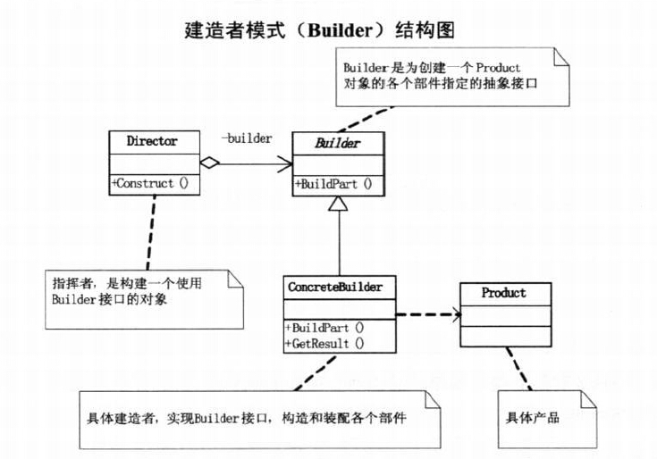
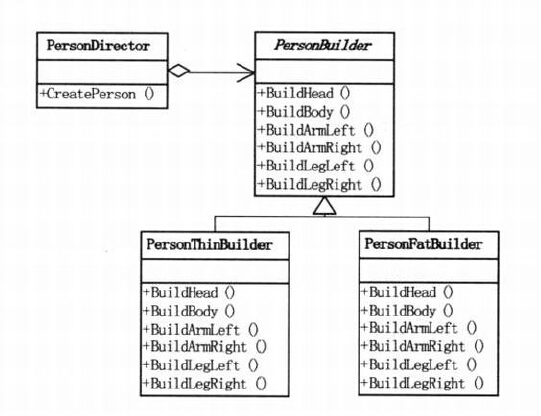
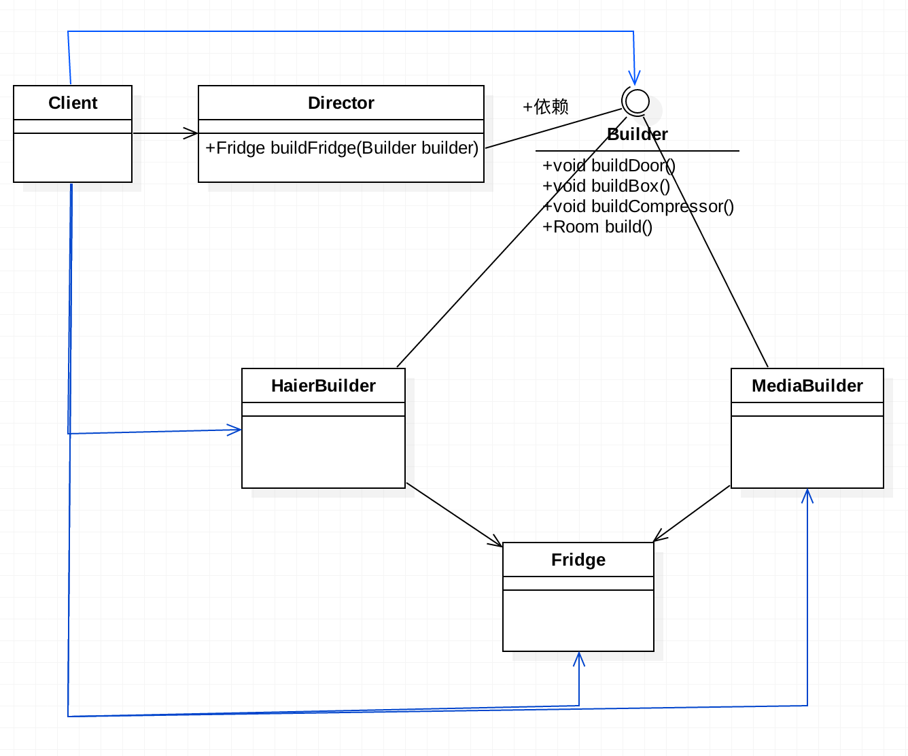
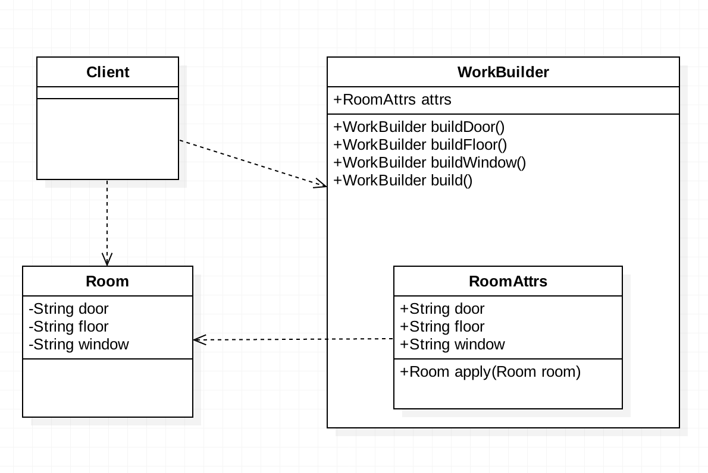

# 需求背景
设计一个创建冰箱或房子的程序。

# 需求分析
不管是冰箱还是房子，都有一个特性：建造步骤稳定，但每个步骤的细节可以很复杂。以冰箱为例，
冰箱都可以划分这么几大块：门体、箱体、压缩机。但是每个部分却又都可以包含很多种类，比如：
门体：两门，三门，对开门，箱体：100L，200L，500L，压缩机：日本制造，德国制造，中国制造。
像这种建造过程是稳定的，但是每个建造步骤的细节又是复杂多变的场景，就可以用建造者模式。

# 架构设计	
+ 建造者模式：将一个复杂对象的构建与它的表示层分离，使得同样的构建过程可以创建不同的表示。
它主要用于创建一些复杂的对象，这些对象内部的建造顺序通常是非常稳定的，但是构建细节复杂多变。
建造者模式的好处就是使得建造代码和表示代码分离，由于建造者模式隐藏了该产品是如何组装的，
所以若需要改变一个产品的内部表示，只需要再定义一个新的具体的建造者就可以了。
  + 要点1：产品的各个部件及其构建顺序（或步骤）通常是稳定的。
  + 要点2：每一个部件都有复杂的表现形式。

+ 建造者模式和装饰设计模式的区别
  + 装饰设计模式是将对象的功能按照重要程度划分为：核心功能和装饰功能。对象专注于核心功能，
  装饰功能由装饰类去负责。建造者模式是将对象的创建按照特定的步骤进行划分，该步骤要求非常稳定，
  但每一步骤的具体细节可以复杂多变。装饰设计模式是一刀切，一边是核心部分，一边是装饰部分；
  建造者模式是将建造层和表示层分离，使得同一套建造流程，可以适用于建造不同表示的对象。
+ 如果说装饰设计模式解决的是给对象动态添加功能的问题，那么建造者模式解决的是，为对象的创建
  提供稳定框架的问题。
  
      本例的3个demo分别是建造者模式的3中不同表达形式，其中demo03是demo02的简化版，我们使用开发中用的很多。  

# UML类图

