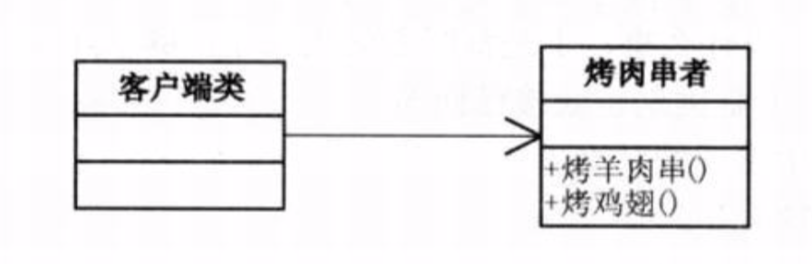
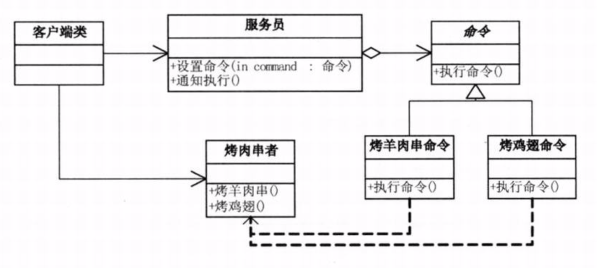
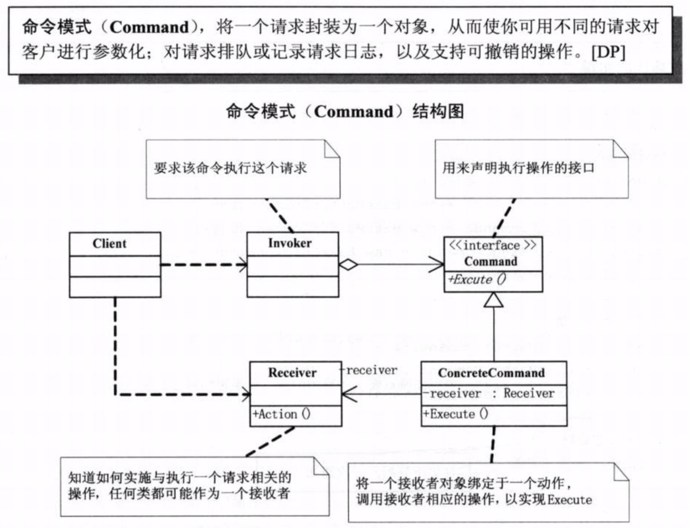

# 需求背景
我们夏天去吃烧烤，通常要么是去路边摊，要么去门店。路边摊客户直接面向厨师，耦合性非常强，并且当客户非常多的时候，容易出现混乱。取消订单、找错钱、没烤熟等等。但是如果是门店，客户面向的是服务员，服务员接收订单并且通知厨房去做，由于有订单记录，所以取消订单什么的也非常方便，也不容易找错钱。将上面这个生活中常见的场景用代码的形式体现出来。

# 结构设计
1. 紧耦合设计（路边摊）

虽然代码非常简单，但耦合性太强，有非常多的隐患，比如杂乱无序，无法取消订单，无记录日志等等。`伪代码参考demo01`
    
2. 松耦合设计（门店）

    主要代码基本都写出来了，发起请求者和执行请求者进行了解耦，当新增命令(此处指烧烤店的菜单）时，也变得非常容易，直接新增一个类继承Command即可。但是对本项目需求而言，还有一些缺陷(伪代码参考demo02)：

     + 真实情况并不是用户点一个菜，服务员就去通知厨房做一个菜，应该是客户点完菜后服务员一次性通知厨房去制作；
     + 如果某个菜没有了，不应该由客户端去判断，应该由服务员或者厨师来否决这个请求；
     + 客户点了哪些烧烤或者饮料，是需要记录的，以便后面收费，包括后期统计；
     + 客户完全有可能取消一些还没做的订单；
    
3. 松耦合设计(改进版)
 
 
    改进设计(伪代码参考demo03)：
    + 在2的基础上，Waiter类通过一个List集合来存储不同的命令实例。
    + 增加订单和取消订单时，分别对应集合的add和remove操作；
    + 执行订单的增加、取消操作时，增加了日志记录；
    + 当某个命令不能执行时，由Waiter去否决掉它；
    + 最后，当订单确定后，通过遍历集合的方式去依次执行。
     
# 命令模式
**将一个请求封装为一个对象，从而使你可用不同的请求对客户进行参数化；对请求排队或记录请求日志，以及支持可撤销的操作。**

命令模式的作用：
1. 它能较容易的设计一个命令队列；
2. 在需要的情况下，可以较容易地将命令记录日志；
3. 允许接收请求的一方决定是否否决请求；
4. 可以容易地实现请求的撤销和重做；
5. 由于加进新的具体命令类不影响其他的类，因此增加新的具体命令类很容易；
6. 命令模式把请求一个操作的对象与知道怎么执行一个操作的对象分隔开(最关键)；

ps：命令模式支持撤销和恢复，但是假如我们我不确定后期是否需要这个功能时，你要不要使用命令模式？
答：不使用。敏捷开发原则告诉我们，不要为代码添加基于猜测的、实际不需要的功能。如果不清楚一个系统是否需要命令模式，一般就不要着急需实现它，事实上，在需要的时候通过重构实现这个模式并不困难，只有在真正需要如撤销/回复操作等功能时，把原来的代码重构为命令模式才有意义。
