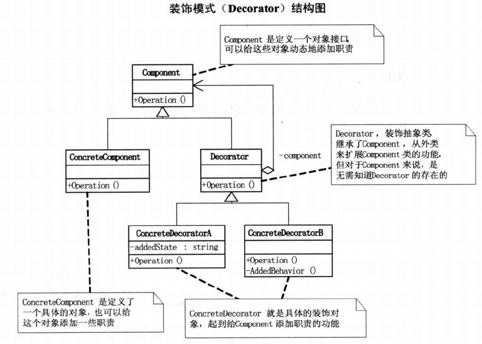
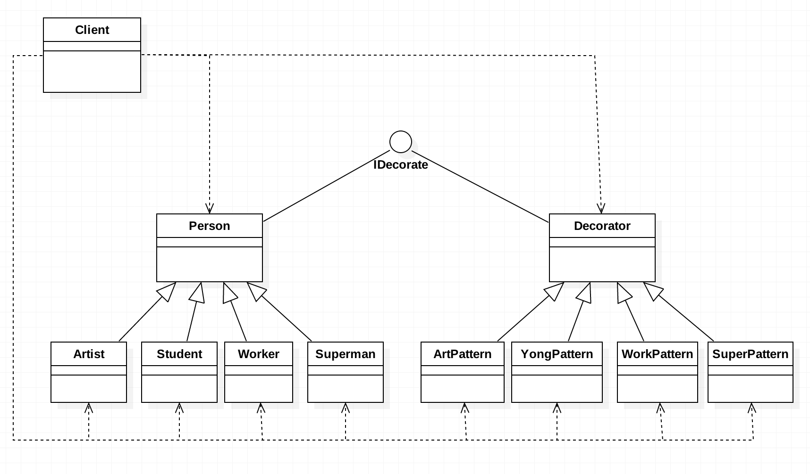

# 需求背景
假设学生、职场人士、艺术家等都需要打扮才能出门，不同角色当然有最核心的关注点，如学生：年轻；职场人士：干练；艺术家：抽象。
然后再配合上一些具体手段就可以出门了。
+ 学生年轻风格：大T恤，垮裤，破球鞋；
+ 职场人干练风格：西装，皮鞋，领带；
+ 艺术家颓废风格：长头发，胡子，不修边幅；

要求写一个程序，实现给上面三种角色对应的穿着风格。

# 进阶历程
### 阶段一
+ 最原始的做法：写3个类，分别对应学生、职场人、艺术家，然后分别定义一个decorate()方法，执行不同的风格内容。
+ 客户端:分别创建这3个角色，然后分别调用各自的打扮功能，从而达到需要的效果。
+ 问题来了:
  1. 需要新增需求===>超人的另类风格：红披风，蓝色紧身服，内裤外穿，当然其核心关注点：另类。 
    解决：新增一个超人的类，按照前面的方法，定义穿红披风，紧身服等方法。
  2. 需要新增需求===>给学生颓废风格，给艺术家干练风格。 
	 解决：在不修改源代码的基础上，根本解决不了，即使修改源代码，根据"开放-封闭原则"，一旦发生了变化，就要考虑
	 "同类变化的发生"，那么就要想到今后可能会出现 "颓废的超人" 这种需求。所以自然而然想到将人物角色和打扮风格
	 分离，这和之前将界面显示逻辑和运算逻辑分离一样的道理。
	 
### 阶段二
+ 将人物角色和打扮风格进行解耦，人物角色作为一个类，只关注其核心职责（本例里核心职责就是"各自的核心关注点"），
  打扮风格作为一个类，只关注其扩展的功能（比如学生年轻风格：大T恤，垮裤，破球鞋）。
+ 当需要对一个人物角色进行打扮时，直接将该角色作为参数传递给对应的风格类即可。至于是传递给构造函数，还是传递给
  一般方法就看是如何设计的了。IO流中，BufferedReader 的设计模式就是传递给构造函数，本例设计传递给一般函数。
+ 但是一种风格只对应一个角色吗？比如年轻风格，可以装扮学生，也可以装扮职场人士，所以就不能简单的传递具体类的实例过去，
  可以传递一个向上抽取的父类对象，于是需要定义一个学生、职场人士、艺术家、超人等的父类：Person。同样，各种不同风格的类，
  都有一个共同的功能就是装扮，以后新增风格类也一样，所以也要抽取一个父类来定义这个功能，这样就得到了打扮风格类的父类Decorator。 
  不管Person及其子类，还是Decorator及其子类，它们的功能都是打扮，只不过Person及其子类专注的是核心功能，而Decorator及其子类
  专注的是扩展功能而已。
+ 这样得到装饰设计模式的核心架构： 
  IDecorate:
      ===>Person
            -->Student
      	    -->Worker
      	    -->Artist
      	    -->Superman
      ===>Decorator
      	 	-->YongPattern
      	 	-->WorkPattern
      	 	-->ArtPattern
      	 	-->SuperPattern
     
   具体架构弄清楚了，就可以设计第二版代码（demo2）,现在不管是要新增角色也好，新增扩展风格也好，都可以很方便的解决。
   完全符合:"开放-封闭原则"，只增加代码，不修改代码。   
     
     
     注意：由于Person、Decorator的功能都是装扮(decorate())，所以有时候也这么做，省略IDecorate接口，直接用Decorator继承Person。
     此时项目结构如下：
     Person：
     ===>Student
     ===>Worker
     ===>Artist
     ===>Superman
     ===>Decorator
            -->YongPattern
     	-->WorkPattern
     	-->ArtPattern
     	-->SuperPattern
     特殊情况一:当Person只有一个子类时，就可以不要Person，Decorator直接继承这个子类即可。
     特殊情况二:当Decorator只有一个子类时，可以不要Decorator，由其子类直接替代Decorator去继承Person。
     IO流中，BufferedReader就是特殊情况二，它是一个具体的子类，直接去继承Reader，然后用来增强Reader的子类：FileReader。

# 总结	
1. 装饰模式通过setDecorate()方法对对象进行包装，这样每个装饰对象只需关注其装饰功能，不用去管这个需装饰的对象如何去使用
  	  	(对象的核心功能我们不用去管)。被装饰的对象只管核心功能，装饰对象只管扩展功能。
2. 装饰设计模式是为已有功能动态的添加更多功能的一种方式。起初的设计中，当系统需要新的功能时，会在旧的类中添加新的代码，
   这些新加的代码，通常装饰了已有类的核心职责或主要行为。但这种做法的问题在于，它在主类中加入了新的字段，新的方法和新的逻辑，
   从而增加了主类的复杂度，而这些新加入的东西仅仅是为了满足一些只有在特定情况下才会执行的特殊行为的需要。装饰模式就很好的
   提供了解决方案，它把每个要装饰的功能放到一个单独的类中，并让这个类包装它所要装饰的对象，因此当需要执行特殊行为时，客户
   端代码就可以根据需要有选择的、按顺序的使用装饰功能包装对象了。
3. 装饰模式的优点：a.把类中的装饰功能从类中搬移去除，这样可以简化原有的类；b.有效的把类的核心职责和装饰功能区分开了，
   而且可以去除相关类中重复的装饰逻辑。

# UML类图

	    
	    
	            
	    