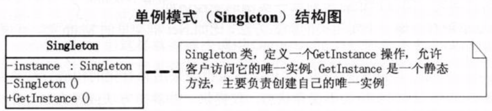

# 单例模式
保证一个类仅有一个实例，并提供一个访问它的全局访问点。


通常有7种写法，包括：饿汉式、懒汉式、静态内部类、枚举等等等等。

# 饿汉式

```
public class Singleton {  
     private static Singleton instance = new Singleton();  
     private Singleton (){
     }
     public static Singleton getInstance() {  
     return instance;  
     }  
 }  
```
+ 在类加载时就完成了初始化，所以类加载较慢，但获取对象的速度快.
+ 基于类加载机制避免了多线程的同步问题，但是也不能确定有其他的方式（或者其他的静态方法）导致类装载.


# 懒汉式(线程不安全)

```
public class Singleton {  
      private static Singleton instance;  
      private Singleton (){
      }   
      public static Singleton getInstance() {  
      if (instance == null) {  
          instance = new Singleton();  
      }  
        return instance;  
      }  
 }  
```
+ 懒汉模式申明了一个静态对象，在用户第一次调用时初始化.
+ 虽然节约了资源，但第一次加载时需要实例化，反映稍慢一些.
+ 存在线程安全隐患.

# 懒汉式(线程安全)

```
public class Singleton {  
      private static Singleton instance;  
      private Singleton (){
      }
      public static synchronized Singleton getInstance() {  
      if (instance == null) {  
          instance = new Singleton();  
      }  
        return instance;  
      }  
 }  
```
在多线程中很好的工作，但是每次调用getInstance方法时都需要进行同步，造成不必要的同步开销，而且大部分时候我们是用不到同步的，所以不建议用这种模式.

# 双重检查模式（DCL）


```
public class Singleton {  
      private volatile static Singleton singleton;  
      private Singleton (){
      }   
      public static Singleton getInstance() {  
      if (instance== null) {  
          synchronized (Singleton.class) {  
          if (instance== null) {  
              instance= new Singleton();  
          }  
         }  
     }  
        return singleton;  
     }  
 }  
```
+ 在getSingleton方法中对singleton进行了两次判空，第一次是为了不必要的同步，第二次是在singleton等于null的情况下才创建实例.
+ 用到了volatile关键字，保证了不同线程对这个变量进行操作时的可见性（即一个线程修改了变量的值，这新值对其他线程来说是立即可见的），并且禁止进行指令重排序。

# 静态内部类单例模式

```
public class Singleton { 
    private Singleton(){
    }
      public static Singleton getInstance(){  
        return SingletonHolder.sInstance;  
    }  
    private static class SingletonHolder {  
        private static final Singleton sInstance = new Singleton();  
    }  
} 

```

# 枚举单例

```
public enum Singleton06 implements ISingleton {
    INSTANCE {
        @Override
        public void doSomething() {
            //TODO
        }
    };

    //这个构造函数在枚举里可以省略
//    private Singleton06() {
//    }

    public static Singleton06 getInstance() {
        return INSTANCE;
    }
}
```
+ 默认枚举实例的创建是线程安全的，并且在任何情况下都是单例.
+ 对于一个标准的enum单例模式，最优秀的写法还是实现接口的形式.

# 使用容器实现单例模式

```
public class SingletonManager { 
　　private static Map<String, Object> instanceMap = new HashMap<String,Object>();
　　private SingletonManager() { 
　　}
　　public static void registerInstance(String key, Object instance) {
　　　　if (!objMap.containsKey(key) ) {
　　　　　　instanceMap(key, instance) ;
　　　　}
　　}
　　public static Object getInstance(String key) {
　　　　return instanceMap.get(key) ;
　　}
}

```	    
+ 用SingletonManager 将多种的单例类统一管理，在使用时根据key获取对象对应类型的对象.
+ 这种方式使得我们可以管理多种类型的单例，并且在使用时可以通过统一的接口进行获取操作，降低了用户的使用成本，也对用户隐藏了具体实现，降低了耦合度.    
	            
	    