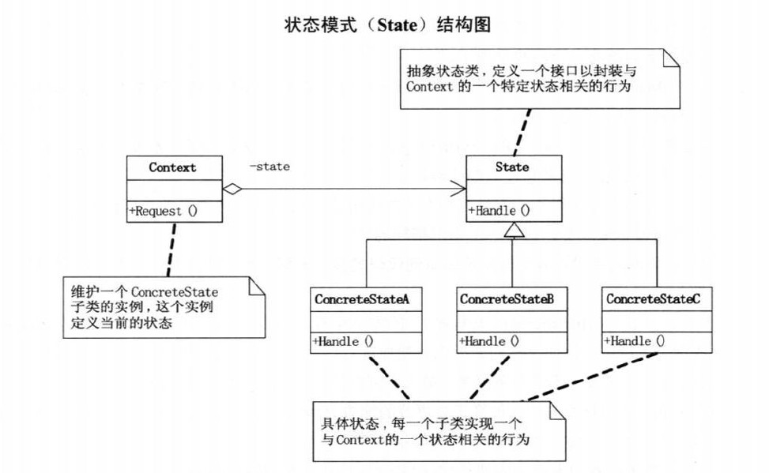
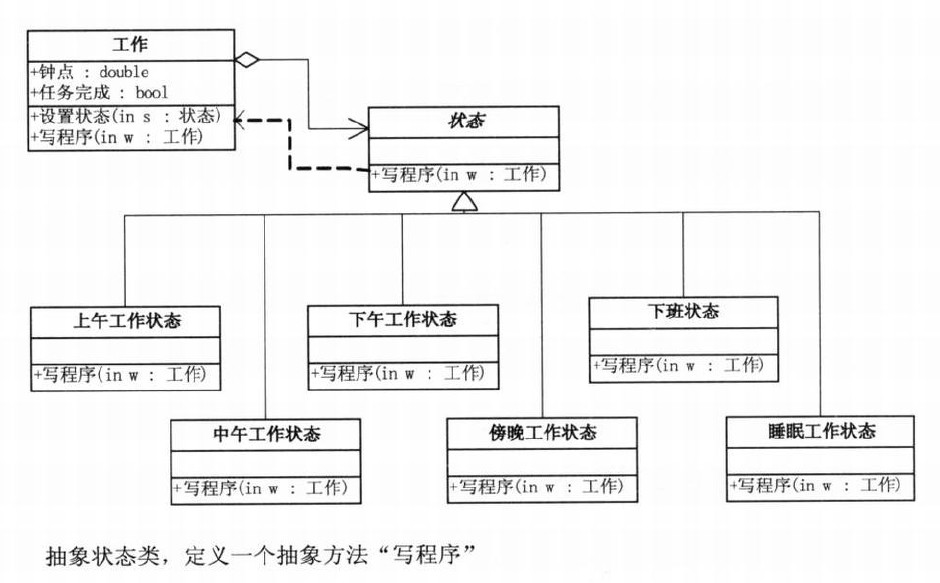
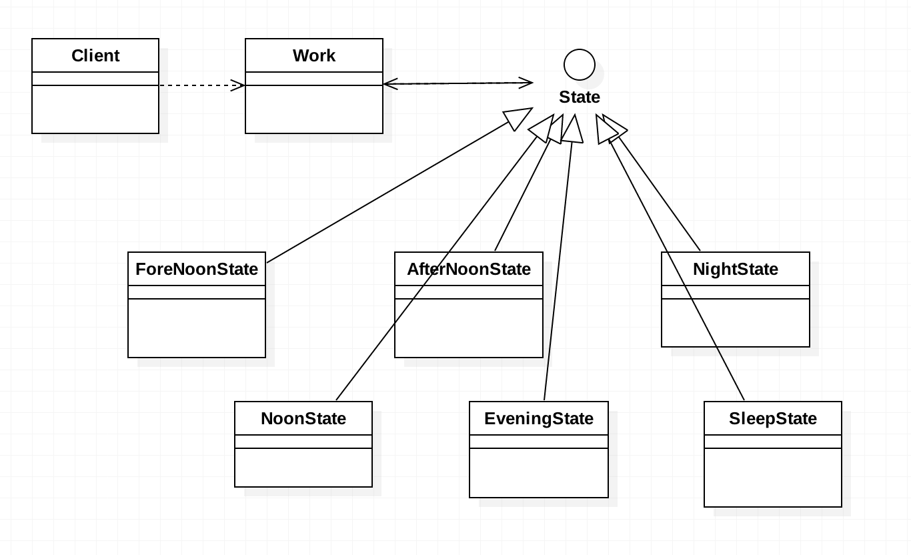

# 需求
一天的工作可以分为如下阶段：上午(ForeNoon)、中午(Noon)、下午(AfterNoon)、傍晚(Evening)、晚上(Night)、深夜(Sleep)。
每个不同的阶段，人的工作效率、精神状态等都不一样，要求将这个特性用代码表示出来。

# 思路
+ 阶段一：在测试类中定义一个方法(不同状态通过条件分支语句判断)，在测试方法中直接调用该方法即可。
+ 阶段二：定义一个Work类，在Work类中声明相关属性，比如hour,isFinish等，然后定义一个方法(仍然有很多条件分支语句)，
  在测试类中创建Work类的示例，然后调用该方法。
+ 阶段三：阶段二虽然已经有面向对象的思想了，但是定义了一个过长的方法，并且方法内条件分支语句过多，不利于维护和扩展，
  因此引入状态模式。首先定义一个状态接口，然后定义各个不同的时间段的工作状态子类实现这个接口。在每个工作状态子类中，
  都有2行至关紧要的代码:
		      
	    work.setState(new XXXState());    //XXXState为当前阶段的下一阶段的状态
		work.getWorkState();
  这两句都出现在else语句中，表示当前时间如果不在本阶段，那么就自动切换到下一工作状态，自动获取下一阶段的工作状态，递归调用，
  直到获取到正确的工作状态为止。
     
# 状态模式
当一个对象的内在状态改变时允许改变其行为，这个对象看起来就像是改变了其类。
+ 状态模式解决的问题是: 当控制一个对象状态转换的条件表达式过于复杂时，我们可以把状态的判断逻辑迁移到表示不同状态的一系列类中。
+ 状态模式的好处是：将与特定状态相关的行为局部化，并且将不同状态的行为分割开来。目的就是消除庞大的条件分支语句。庞大的分支语句
  会使它们难以修改和扩展，就像刻板印刷一样，任何改动和变化都是致命的。状态模式，通过把各种状态的判断逻辑，分布到各State的子类
  之间，减少相互间的依赖，好像把整个版面变成一个一个活字，此时就容易维护和扩展了!
+ 什么时候用状态模式？
  + 当一个对象的行为取决于它的状态，并且它必须在运行时刻根据状态改变它的行为时，就可以考虑使用状态模式。
  + 如果某项业务有多个状态，通常都是一些枚举常量，状态的变化都是依靠大量的多分支语句来实现，此时应考虑将每一种业务状态定义为
    一个State子类，这样这些子类就可以不依赖其他子类独立变化了。
+ LongMethod，方法过长，就是一种代码坏的味道。如果一个方法包含过多的条件分支，意味着它的责任过大，任何一个状态都需要通过它来
  判断、改变，而面向对象设计其实就是希望做到代码的责任分离，也就是"单一职责"原则。

# UML类图

